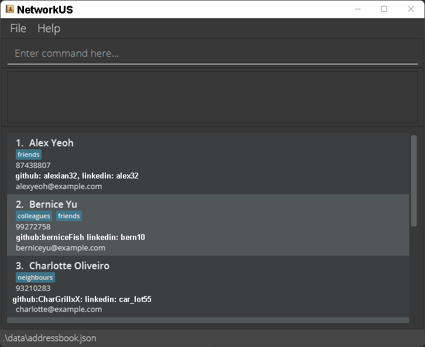

NetworkUs is an contact book application that helps **Computer Science students** maintain a list of contacts of people they meet in school.
NetworkUs allows students to store their friends' Github and LinkedIn account so that they can collaborate on project in future.

Features:
* Store list of contacts of people you have met
* Find friends who have similar interest for project collaboration
* Search contact based on module

This project is based on the AddressBook-Level3 project created by the [SE-EDU initiative](https://se-education.org).
