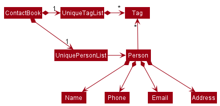

* Table of Contents
{:toc}

--------------------------------------------------------------------------------------------------------------------

## **Acknowledgements**

* This project is adapted from AB3

--------------------------------------------------------------------------------------------------------------------

## **Setting up, getting started**

Refer to the guide [_Setting up and getting started_](SettingUp.md).

--------------------------------------------------------------------------------------------------------------------

## **Design**

:bulb: **Tip:** The `.puml` files used to create diagrams in this document can be found in the [diagrams](https://github.com/AY2122S1-CS2103T-T10-3/tp/tree/master/docs/diagrams) folder. Refer to the [_PlantUML Tutorial_ at se-edu/guides](https://se-education.org/guides/tutorials/plantUml.html) to learn how to create and edit diagrams.

### Architecture

The ***Architecture Diagram*** given above explains the high-level design of the App.

Given below is a quick overview of main components and how they interact with each other.

**Main components of the architecture**

**`Main`** has two classes called [`Main`](https://github.com/AY2122S1-CS2103T-T10-3/tp/tree/master/src/main/java/seedu/address/Main.java) and [`MainApp`](https://github.com/AY2122S1-CS2103T-T10-3/tp/tree/master/src/main/java/seedu/address/MainApp.java). It is responsible for,
* At app launch: Initializes the components in the correct sequence, and connects them up with each other.
* At shut down: Shuts down the components and invokes cleanup methods where necessary.

[**`Commons`**](#common-classes) represents a collection of classes used by multiple other components.

The rest of the App consists of four components.

* [**`UI`**](#ui-component): The UI of the App.
* [**`Logic`**](#logic-component): The command executor.
* [**`Model`**](#model-component): Holds the data of the App in memory.
* [**`Storage`**](#storage-component): Reads data from, and writes data to, the hard disk.

**How the architecture components interact with each other**

The *Sequence Diagram* below shows how the components interact with each other for the scenario where the user issues the command `delete 1`.

Each of the four main components (also shown in the diagram above),

* defines its *API* in an `interface` with the same name as the Component.
* implements its functionality using a concrete `{Component Name}Manager` class (which follows the corresponding API `interface` mentioned in the previous point.

For example, the `Logic` component defines its API in the `Logic.java` interface and implements its functionality using the `LogicManager.java` class which follows the `Logic` interface. Other components interact with a given component through its interface rather than the concrete class (reason: to prevent outside component's being coupled to the implementation of a component), as illustrated in the (partial) class diagram below.

The sections below give more details of each component.

### UI component

The **API** of this component is specified in [`Ui.java`](https://github.com/AY2122S1-CS2103T-T10-3/tp/tree/master/src/main/java/seedu/address/ui/Ui.java)

The UI consists of a `MainWindow` that is made up of parts e.g.`CommandBox`, `ResultDisplay`, `PersonListPanel`, `StatusBarFooter` etc. All these, including the `MainWindow`, inherit from the abstract `UiPart` class which captures the commonalities between classes that represent parts of the visible GUI.

The `UI` component uses the JavaFx UI framework. The layout of these UI parts are defined in matching `.fxml` files that are in the `src/main/resources/view` folder. For example, the layout of the [`MainWindow`](https://github.com/AY2122S1-CS2103T-T10-3/tp/tree/master/src/main/java/seedu/address/ui/MainWindow.java) is specified in [`MainWindow.fxml`](https://github.com/AY2122S1-CS2103T-T10-3/tp/tree/master/src/main/resources/view/MainWindow.fxml)

The `UI` component,

* executes user commands using the `Logic` component.
* listens for changes to `Model` data so that the UI can be updated with the modified data.
* keeps a reference to the `Logic` component, because the `UI` relies on the `Logic` to execute commands.
* depends on some classes in the `Model` component, as it displays `Person` object residing in the `Model`.

### Logic component

**API** : [`Logic.java`](https://github.com/AY2122S1-CS2103T-T10-3/tp/tree/master/src/main/java/seedu/address/logic/Logic.java)

Here's a (partial) class diagram of the `Logic` component:

How the `Logic` component works:
1. When `Logic` is called upon to execute a command, it uses the `ContactBookParser` class to parse the user command.
1. This results in a `Command` object (more precisely, an object of one of its subclasses e.g., `AddCommand`) which is executed by the `LogicManager`.
1. The command can communicate with the `Model` when it is executed (e.g. to add a person).
1. The result of the command execution is encapsulated as a `CommandResult` object which is returned back from `Logic`.

The Sequence Diagram below illustrates the interactions within the `Logic` component for the `execute("delete 1")` API call.

:information_source: **Note:** The lifeline for `DeleteCommandParser` should end at the destroy marker (X) but due to a limitation of PlantUML, the lifeline reaches the end of diagram.

Here are the other classes in `Logic` (omitted from the class diagram above) that are used for parsing a user command:

How the parsing works:
* When called upon to parse a user command, the `ContactBookParser` class creates an `XYZCommandParser` (`XYZ` is a placeholder for the specific command name e.g., `AddCommandParser`) which uses the other classes shown above to parse the user command and create a `XYZCommand` object (e.g., `AddCommand`) which the `ContactBookParser` returns back as a `Command` object.
* All `XYZCommandParser` classes (e.g., `AddCommandParser`, `DeleteCommandParser`, ...) inherit from the `Parser` interface so that they can be treated similarly where possible e.g, during testing.

### Model component
**API** : [`Model.java`](https://github.com/AY2122S1-CS2103T-T10-3/tp/tree/master/src/main/java/seedu/address/model/Model.java)

The `Model` component,

* stores the user's contacts i.e., all `Person` objects (which are contained in a `UniquePersonList` object).
* stores the currently 'selected' `Person` objects (e.g., results of a search query) as a separate _filtered_ list which is exposed to outsiders as an unmodifiable `ObservableList<Person>` that can be 'observed' e.g. the UI can be bound to this list so that the UI automatically updates when the data in the list change.
* stores a `UserPref` object that represents the user’s preferences. This is exposed to the outside as a `ReadOnlyUserPref` objects.
* does not depend on any of the other three components (as the `Model` represents data entities of the domain, they should make sense on their own without depending on other components)

:information_source: **Note:** An alternative (arguably, a more OOP) model is given below. It has a `Tag` list in the Network List, which `Person` references. This allows the Network List to only require one `Tag` object per unique tag, instead of each `Person` needing their own `Tag` objects. 

### Storage component

**API** : [`Storage.java`](https://github.com/AY2122S1-CS2103T-T10-3/tp/tree/master/src/main/java/seedu/address/storage/Storage.java)

The `Storage` component,
* can save both contacts data and user preference data in json format, and read them back into corresponding objects.
* inherits from both `ContactBookStorage` and `UserPrefStorage`, which means it can be treated as either one (if only the functionality of only one is needed).
* depends on some classes in the `Model` component (because the `Storage` component's job is to save/retrieve objects that belong to the `Model`)

### Common classes

Classes used by multiple components are in the `seedu.contactbook.commons` package.

--------------------------------------------------------------------------------------------------------------------

## **Implementation**

This section describes some noteworthy details on how certain features are implemented.

### Find tag feature

#### Implementation

The find tag mechanism builds on the find name feature and is facilitated by `NameAndTagsContainKeywordsPredicate` which implements `Predicate<Person>` and is created when `FindCommandParser` inputs the userinput keywords into its constructor as a `List<String>`.  
It implements the following operation:
* `NameAndTagsContainKeywordsPredicate#test(Person person)` - tests whether the input `Person` object has a name or tag which matches any of the keywords.

The predicate is then used by `Model#updateFilteredPersonList(Predicate<Person>)`  to change the _filtered_ list in the `Model` component exposed as and observed by the UI component as an unmodifiable `ObservableList<Person>` to display to the user.

The Sequence Diagram below illustrates the interactions within the `Logic` component for the `execute("find programmer")` API call.

#### Design considerations:

How find matches tags and keywords:
* Alternative 1 (Current choice): Word match
    * Pros: Easy to implement and fast performance
    * Cons: Less flexibility for valid user inputs
* Alternative 2 : Substring match
    * Pros: More flexibility for valid user inputs
    * Cons: May have performance issues for speed

### Tag person feature

#### Implementation

The tag person mechanism is facilitated by `ParserUtil#parseTag(String tag)` and `ParserUtil#parseIndex(String oneBasedIndex)`.  
`ParserUtil#parseTag(String tag)` checks whether the input conforms to the restrictions of a `Tag` and if so returns a `Tag` with the input as its value.  
`ParserUtil#parseIndex(String oneBasedIndex)` checks whether the input can be an unsigned non-zero integer and if so returns an `Index` with the integer as the value.  

The `Tag` and multiple `Index` are used to find multiple `Person` objects from `filteredPersons`.   
They are then replaced with `Person` objects with the `Tag` using `model#setPerson(Person target, Person editedPerson)`.

The Sequence Diagram below illustrates the interactions within the `Logic` component for the `execute("tag 1 2 programmer")` API call.

The Activity Diagram below summarizes what happens when the user executes a Tag command. 

#### Design consideration

What the specified indexes refer to:
* Alternative 1 (Current choice): Using `filteredList` to specify what `Index` refers to.
    * Pros: Ability to tag visible persons
    * Cons: Inability to tag not visible persons

* Alternative 2 : Using list of all persons to specify what `Index` refers to.
    * Pros: Ability to tag persons regardless of filter
    * Cons: Requires knowledge of person's unfiltered list index to tag accurately 

Whether invalid indexes should be addressed:
* Alternative 1 (Current choice): Invalid indexes are pointed out.
    * Pros: Ability to know when incorrect indexes are used
    * Cons: More restrictive and unable to progress due to a potentially inconsequential mistake

* Alternative 2 : Invalid indexes are ignored.
    * Pros: Ability to tag persons flexibly
    * Cons: May result in users believing the function behaves differently than it actually does

### Replace Tag feature

#### Implementation

The replace tag mechanism is facilitated by `TagPresentPredicate` which implements `Predicate<Person>` and is created
when arguments is pass to `ReplaceTagCommandParser`.  
`TagPresentPredicate` checks whether person has `Tag` to be replaced and is used to filter the list of `person` in `Model`.
From the filtered list of `person`, each `person` is replaced with a new `person` with the new replaced `tag`

#### Design consideration

How the specified tag is filtered:
* Alternative 1 (Current choice): Using `TagPresentPredicate` to filter the list of `person`
    * Pros: Easy to implement
    * Cons: Inefficient (need to search through the list of `person`)

* Alternative 2 : Unique Tag list
    * Pros: Easier to search for the specified tag
    * Cons: Required change of implementation of `Tag` which could affect the rest of the command

### Open Field feature

#### Implementation

The Open Field mechanism is facilitated by `openUrl` helper function which calls the desired generated url from the persons' field details (Github / LinkedIn). It is created when arguments are pass to `OpenFieldCommandParser`.  
`OpenFieldCommand` checks whether the field parsed in is valid. If valid, it checks if the field of the user is not empty. If not empty, it then opens the desired user profile in the user's browser.

#### Design consideration

How the URL is opened:
* Alternative 1 (Current choice): Using `java.awt.Desktop.browse(URI)` to open it in the user's browser
    * Pros: Easy to implement
    * Pros: User default browser carries extensive tools for continuing his search from the desired page
    * Cons: Directs traffic away from desktop application
    * Cons: User might dislike NetworkUS application intruding into their browser application

* Alternative 2 : Using JavaFX to open it as another popup / inbuilt pane
    * Pros: Allows for same interface of desktop application and similar stylings
    * Cons: Required `javafx-web` which increases Jar space by nearly 7 folds
    * Cons: Slower loading time

### Alias feature

#### Implementation

The alias feature is facilitated by `AliasTable` which stores the key-value pairs of aliases and commands. It is stored in the `Model` package which manages the user preferences setting. All added aliases will be stored in json file and will be loaded every time NetworkUS boots up. 
The alias command will take in the alias and the command to be aliased. The aliased command must be a valid command. The alias must not be the existing command. 
When the `AliasCommand` executed, it simply adds a new entry to the `AliasTable` via `Model` interface. It displays the result of the command's execution.

#### Design consideration

How aliases should be managed:
* Alternative 1 (Current choice): We put constraint on the alias to not take existing command
    * Pros: It is safer for user to use alias
    * Cons: Constraint is not rigorous enough to cover all other cases that can mess up with the app
* Alternative 2: We don't put any constraint on the alias command
    * Pros: Easier to implement
    * Cons: More dangerous to use the alias command
    
#### Show Feature
Shows a contact with the specified Index in a new window. It gets the index from the `modelManager` class that contains the `ReadOnlyContactBook` and gets the contact with the specified index.

#### Design consideration

How the specified contact should be shown:
* Alternative 1 (Current choice): Shows the specified user in a new window
    * Pros: Much more customizable in the future, Does not clutter the main list view
    * Cons: User might be overwhelmed by the number of windows
* Alternative 2: Overwrite the current view to show the specified person
    * Pros: Not many windows are opened
    * Cons: Hard to see current list of contacts and executes the command (User needs to go back to the previous view)

#### ShowAlias Feature

Shows the mapping of aliases in a window similar to help.

#### Design consideration

How the GUI gets the data:
* Alternative 1 (Current choice): Refreshes everytime the user calls the function
    * Pros: Easier to implement, Does not require a specialized ObservableMap Serializer for the JSON.
    * Cons: Might be a bit slow, but there can't be too many mappings.
* Alternative 2: Use an ObservableMap
    * Pros: The map is only accessed once, remaining changes are automatically updated
    * Cons: Hard to implement
    
--------------------------------------------------------------------------------------------------------------------

## **Documentation, logging, testing, configuration, dev-ops**

* [Documentation guide](Documentation.md)
* [Testing guide](Testing.md)
* [Logging guide](Logging.md)
* [Configuration guide](Configuration.md)
* [DevOps guide](DevOps.md)

--------------------------------------------------------------------------------------------------------------------

## **Appendix: Requirements**

### Product scope

**Target user profile**:
* NUS CS Undergraduates
* wants to maintain connections for purpose of networking
* has a need to manage a significant number of contacts
* prefer desktop apps over other types
* prefer lightweight app (concise targeted features over excessive features)
* prefer local apps to cloud-based online apps
* can type fast
* prefers typing to mouse interactions
* is reasonably comfortable using CLI apps

**Value proposition**: manage potential network opportunities for a NUS CS student

### User stories

Priorities: High (must have) - `* * *`, Medium (nice to have) - `* *`, Low (unlikely to have) - `*`

| Priority | As a …                                 | I want to …​                                      | So that I can…​                                                     |
| -------- | ------------------------------------------ | ---------------------------------------------------- | ---------------------------------------------------------------------- |
| `* * *`  | new user                                   | see usage instructions                               | refer to instructions when I forget how to use the App                 |
| `* * *`  | user                                       | add new contacts                                     |                                                                        |
| `* * *`  | user                                       | delete my existing contacts                          | remove contacts that I no longer need                                  |
| `* * *`  | user                                       | find a person by name                                | locate contacts without having to go through the entire list |
| `* * *`  | user                                       | find people by a tag / group name                    | locate contacts by the category indicated by the tag without having to go through the entire list |
| `* * *`  | user                                       | see all the contacts I have                          |                                                                        |
| `* * *`  | experienced user                           | creates custom alias for specific commands           | work efficiently                                                       |
| `* *`    | longstanding user                          | update details of previously added contacts          | keep them up-to-date                                                   |
| `* *`    | user                                       | add their LinkedIn username                          | professionally network with them through their LinkedIn                                       |
| `* *`    | user                                       | add their GitHub username                            | view their github projects and see which areas they are experienced in                                        |
| `* *`    | new user                                   | see some mock contacts                               | test the commands                                                      |
| `* *`    | new user                                   | be able to clear all mock contacts                   | start creating a fresh contact list                                    |
| `* *`    | user                                       | categorize my contacts based on their specialization | find people with a particular area of expertise                        |
| `* *`    | user                                       | find a person by specialization                      | find a person of a particular area of expertise                        |
| `*`      | user                                       | see the number of friends I have                     | gain a sense of confidence                                             |
| `*`      | user with many persons in the contact list | sort persons by name                                 | locate a person easily                                                 |

### Use cases

(For all use cases below, the **System** is the `NetworkUS` and the **Actor** is the `user`, unless specified otherwise)

**Use case: UC01 Add a person**

**MSS**

1.  User requests to add persons
2.  NetworkUS adds the person

    Use case ends.

**Extensions**

* 1a. The given name and details are duplicated.
    * 1a1. NetworkUS shows an error message.

      Use case resumes at step 1.

**Use case: UC02 Delete a person**

**MSS**

1.  User requests to display list of persons
2.  NetworkUS shows a list of persons
3.  User requests to delete a specific person in the list
4.  NetworkUS deletes the person

    Use case ends.

* 3a. The given index is invalid.
    * 3a1. NetworkUS shows an error message.

      Use case resumes at step 3.

**Use case: UC03 Find a person**

**MSS**

1.  User requests to search a person
2.  NetworkUS shows a list of persons that match the search

    Use case ends.

**Extensions**

* 2a. There is no match and the list is empty.

  Use case ends.

**Use case: UC04 Edit a person's information**

**MSS**

1.  User requests to list persons
2.  NetworkUS shows a list of persons
3.  User requests to edit a specific person's information in the list
4.  NetworkUS edit the person's information

    Use case ends.

**Extensions**

* 2a. The list is empty.

  Use case ends.

* 3a. The given index is invalid.
    * 3a1. NetworkUS shows an error message.

      Use case resumes at step 2.

**Use case: UC05 View list of contact**

**MSS**

1.  User requests to view the list of contacts
2.  NetworkUS shows the list of persons

    Use case ends.

**Extensions**

* 2a. User has no stored contacts

    Use case ends.

**Use case: UC06 help**

**MSS**

1.  User requests to show help
2.  NetworkUs directs user to user guide
3.  User follows directions and views user guide

    Use case ends.

**Extensions**

* 2a. User decides not to view user guide

    Use case ends.

**Use case: UC07 clear**

**MSS**

1.  User requests to clear contacts list
2.  NetworkUs sends confirmation to user
3.  User says yes to the confirmation
4.  NetworkUs deletes all the user's contacts

    Use case ends.

**Extensions**
  
* 3a. The user says no during the confirmation

    NetworkUs aborts deletion

**Use case: UC08 exit**

**MSS**
1. User is finished with tasks and requests to exit application
2. NetworkUs close after several seconds 

    Use case ends.

**Use Case: UC09 showtags**

**MSS**
1. User request to show all tags in NetworkUS
2. NetworkUS returns unique tags to the user

    Use case ends.

**Use Case: UC10 alias**

**MSS**
1. User creates alias for a certain command
2. NetworkUS saves and stores the alias for the certain command

   Use case ends.

**Use case: UC11 Tag persons**

**MSS**

1.  User requests to list persons
2.  NetworkUS shows a list of persons
3.  User requests to tag specific persons in the list with a specific tag
4.  NetworkUS tags the specified persons with the specified tag

    Use case ends.

**Extensions**

* 2a. The list is empty.

  Use case ends.

* 3a. A given index or the tag is invalid.
    * 3a1. NetworkUS shows an error message.

      Use case resumes at step 2.

**Use case: UC12 Tag all displayed persons**

**MSS**

1.  User requests to list persons
2.  NetworkUS shows a list of persons
3.  User requests to tag all persons in the list with a specified tag
4.  NetworkUS tags all persons in the list with the specified tag

    Use case ends.

**Extensions**

* 2a. The list is empty.

  Use case ends.

* 3a. The given tag is invalid.
    * 3a1. NetworkUS shows an error message.

      Use case resumes at step 2.

### Non-Functional Requirements

1. Should work on any _mainstream OS_ as long as it has Java `11` or above installed.
2. Should be able to hold up to 1000 persons without a noticeable sluggishness in performance for typical usage.
3. A user with above average typing speed for regular English text (i.e. not code, not system admin commands) should be able to accomplish most of the tasks faster using commands than using the mouse.
4. Novices should not have big problems when they first use the product.
5. Late users should be able to work efficiently.
6. UI should focus more on displaying data to user rather than provide means of interactions to user.

### Glossary

* **Mainstream OS**: Windows, Linux, Unix, OS-X
* **Private contact detail**: A contact detail that is not meant to be shared with others
* **Late user**: User who have used the product for more than a month

--------------------------------------------------------------------------------------------------------------------

## **Appendix: Instructions for manual testing**

Given below are instructions to test the app manually.

:information_source: **Note:** These instructions only provide a starting point for testers to work on;
testers are expected to do more *exploratory* testing.

### Launch and shutdown

1. Initial launch

   1. Download the jar file and copy into an empty folder

   1. Double-click the jar file Expected: Shows the GUI with a set of sample contacts. The window size may not be optimum.

1. Saving window preferences

   1. Resize the window to an optimum size. Move the window to a different location. Close the window.

   1. Re-launch the app by double-clicking the jar file. 
       Expected: The most recent window size and location is retained.

### Deleting a person

1. Deleting a person while all persons are being shown

   1. Prerequisites: List all persons using the `list` command. Multiple persons in the list.

   1. Test case: `delete 1` 
      Expected: First contact is deleted from the list. Details of the deleted contact shown in the status message. Timestamp in the status bar is updated.

   1. Test case: `delete 0` 
      Expected: No person is deleted. Error details shown in the status message. Status bar remains the same.

   1. Other incorrect delete commands to try: `delete`, `delete x`, `...` (where x is larger than the list size) 
      Expected: Similar to previous.
