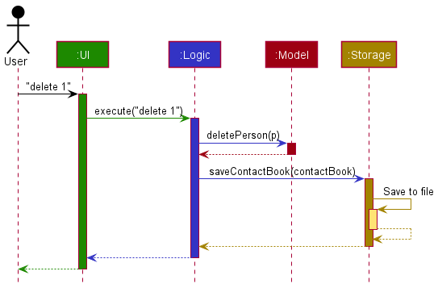
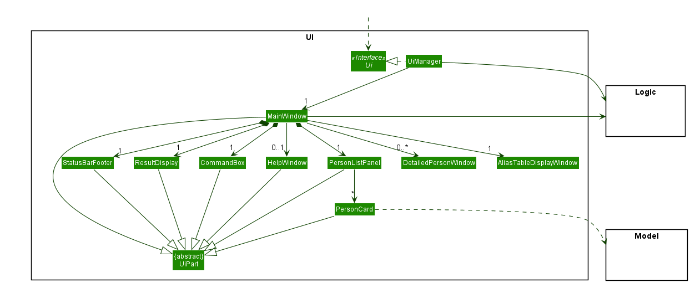
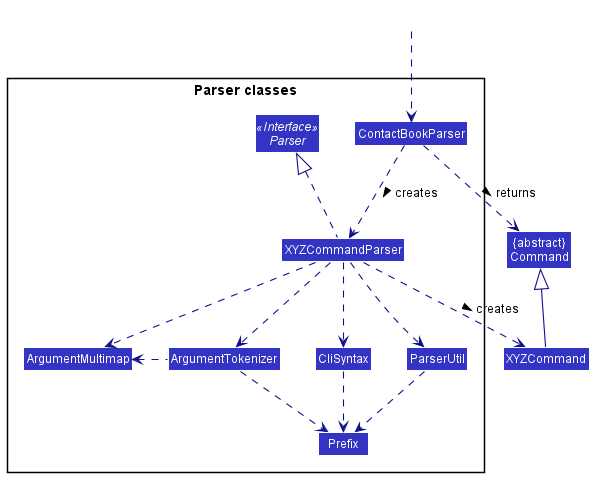
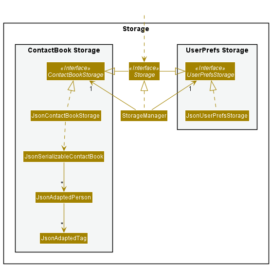
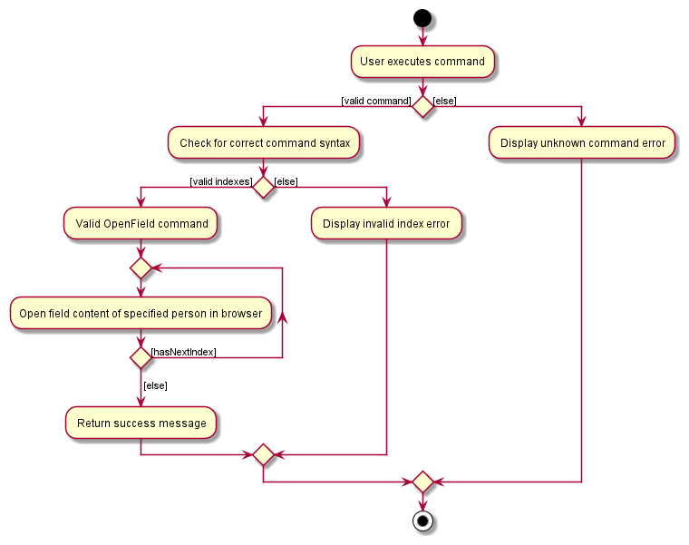
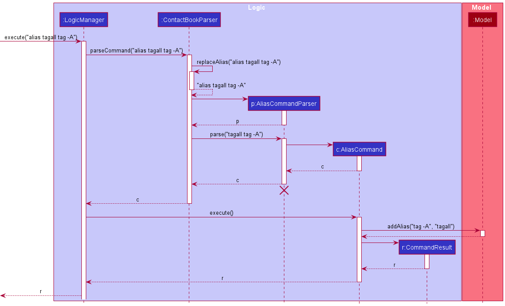
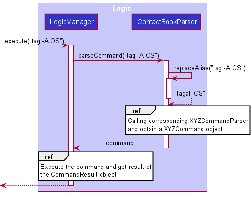
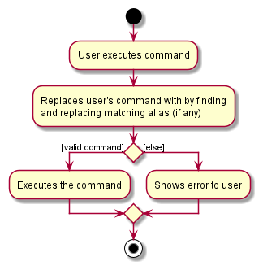
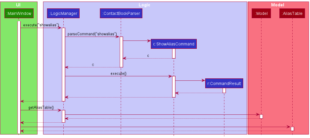
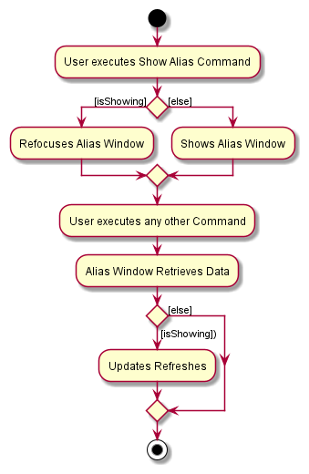

* Table of Contents
{:toc}

--------------------------------------------------------------------------------------------------------------------

## Introduction of guide

This guide aims to provide understanding of the technical details of NetworkUS. It is targeted towards developers as it contains technical documentation. It includes well-documented diagrams, indepth explanation of components and features, and details on NetworkUS specific project workflows (eg. Logging / Testing / Setting Up).

Use this guide if you want to
* Improve on the specific project by adding to its code base
* Adapt NetworkUS for your own use
* Learn from specific implementations of features/components

--------------------------------------------------------------------------------------------------------------------

## How to use this guide

Refer to the **Table of Content** at the start of this guide or ctrl-f keywords to find relevant sections.
A general grouping and a brief description of sections in this guide are provided below.

* Setting up the development environment for NetworkUS: [quick start](SettingUp.md)
* Overarching architectural implementation and component relations: [design](#design)
* Feature specific design and considerations: [implementation](#implementation-of-features)
* NetworkUS idea conceptualization details (value proposition, NFR, use cases and user stories): [Appendix: Requirements](#appendix-requirements)
* Instructions for manual testing of NetworkUS: [testing](#appendix-instructions-for-manual-testing)
* NetworkUS specific workflows and configuration (documentation, logging, testing, developer operations): [workflows and configuration](#documentation-logging-testing-configuration-dev-ops)

--------------------------------------------------------------------------------------------------------------------

## Acknowledgements

* This project is based on the AddressBook Level 3 project created by the [SE-EDU initiative](https://se-education.org).

--------------------------------------------------------------------------------------------------------------------

## Setting up NetworkUS

To set up your development environment for NetworkUS, refer to this guide [_Setting up and getting started_](SettingUp.md).

--------------------------------------------------------------------------------------------------------------------

## **Design**

:bulb: **Tip:** The `.puml` files used to create diagrams in this document can be found in the [diagrams](https://github.com/AY2122S1-CS2103T-T10-3/tp/tree/master/docs/diagrams) folder. Refer to the [_PlantUML Tutorial_ at se-edu/guides](https://se-education.org/guides/tutorials/plantUml.html) to learn how to create and edit diagrams.

### Architecture

The ***Architecture Diagram*** given above explains the high-level design of the App.

Given below is a quick overview of main components and how they interact with each other.

**Main components of the architecture**

**`Main`** has two classes called [`Main`](https://github.com/AY2122S1-CS2103T-T10-3/tp/tree/master/src/main/java/seedu/address/Main.java) and [`MainApp`](https://github.com/AY2122S1-CS2103T-T10-3/tp/tree/master/src/main/java/seedu/address/MainApp.java). It is responsible for,
* At app launch: Initializes the components in the correct sequence, and connects them up with each other.
* At shut down: Shuts down the components and invokes cleanup methods where necessary.

[**`Commons`**](#common-classes) represents a collection of classes used by multiple other components.

The rest of the App consists of four components.

* [**`UI`**](#ui-component): The UI of the App.
* [**`Logic`**](#logic-component): The command executor.
* [**`Model`**](#model-component): Holds the data of the App in memory.
* [**`Storage`**](#storage-component): Reads data from, and writes data to, the hard disk.

**How the architecture components interact with each other**

The *Sequence Diagram* below shows how the components interact with each other for the scenario where the user issues the command `delete 1`.

Each of the four main components (also shown in the diagram above),

* defines its *API* in an `interface` with the same name as the Component.
* implements its functionality using a concrete `{Component Name}Manager` class (which follows the corresponding API `interface` mentioned in the previous point.

For example, the `Logic` component defines its API in the `Logic.java` interface and implements its functionality using the `LogicManager.java` class which follows the `Logic` interface. Other components interact with a given component through its interface rather than the concrete class (reason: to prevent outside component's being coupled to the implementation of a component), as illustrated in the (partial) class diagram below.

The sections below give more details of each component.

### UI component

The **API** of this component is specified in [`Ui.java`](https://github.com/AY2122S1-CS2103T-T10-3/tp/tree/master/src/main/java/seedu/address/ui/Ui.java)

The UI consists of a `MainWindow` that is made up of parts e.g.`CommandBox`, `ResultDisplay`, `PersonListPanel`, `StatusBarFooter` etc. All these, including the `MainWindow`, inherit from the abstract `UiPart` class which captures the commonalities between classes that represent parts of the visible GUI.

The `UI` component uses the JavaFx UI framework. The layout of these UI parts are defined in matching `.fxml` files that are in the `src/main/resources/view` folder. For example, the layout of the [`MainWindow`](https://github.com/AY2122S1-CS2103T-T10-3/tp/tree/master/src/main/java/seedu/address/ui/MainWindow.java) is specified in [`MainWindow.fxml`](https://github.com/AY2122S1-CS2103T-T10-3/tp/tree/master/src/main/resources/view/MainWindow.fxml)

The `UI` component,

* executes user commands using the `Logic` component.
* listens for changes to `Model` data so that the UI can be updated with the modified data.
* keeps a reference to the `Logic` component, because the `UI` relies on the `Logic` to execute commands.
* depends on some classes in the `Model` component, as it displays `Person` object residing in the `Model`.

### Logic component

**API** : [`Logic.java`](https://github.com/AY2122S1-CS2103T-T10-3/tp/tree/master/src/main/java/seedu/address/logic/Logic.java)

Here's a (partial) class diagram of the `Logic` component:

How the `Logic` component works:
1. When `Logic` is called upon to execute a command, it uses the `ContactBookParser` class to parse the user command.
1. This results in a `Command` object (more precisely, an object of one of its subclasses e.g., `AddCommand`) which is executed by the `LogicManager`.
1. The command can communicate with the `Model` when it is executed (e.g. to add a person).
1. The result of the command execution is encapsulated as a `CommandResult` object which is returned back from `Logic`.

The Sequence Diagram below illustrates the interactions within the `Logic` component for the `execute("delete 1")` API call.

:information_source: **Note:** The lifeline for `DeleteCommandParser` should end at the destroy marker (X) but due to a limitation of PlantUML, the lifeline reaches the end of diagram.

Here are the other classes in `Logic` (omitted from the class diagram above) that are used for parsing a user command:

How the parsing works:
* When called upon to parse a user command, the `ContactBookParser` class creates an `XYZCommandParser` (`XYZ` is a placeholder for the specific command name e.g., `AddCommandParser`) which uses the other classes shown above to parse the user command and create a `XYZCommand` object (e.g., `AddCommand`) which the `ContactBookParser` returns back as a `Command` object.
* All `XYZCommandParser` classes (e.g., `AddCommandParser`, `DeleteCommandParser`, ...) inherit from the `Parser` interface so that they can be treated similarly where possible e.g, during testing.

### Model component
**API** : [`Model.java`](https://github.com/AY2122S1-CS2103T-T10-3/tp/tree/master/src/main/java/seedu/address/model/Model.java)

The `Model` component,

* stores the user's contacts i.e., all `Person` objects (which are contained in a `UniquePersonList` object).
* stores the currently 'selected' `Person` objects (e.g., results of a search query) as a separate _filtered_ list which is exposed to outsiders as an unmodifiable `ObservableList<Person>` that can be 'observed' e.g. the UI can be bound to this list so that the UI automatically updates when the data in the list change.
* stores a `UserPref` object that represents the user’s preferences. This is exposed to the outside as a `ReadOnlyUserPref` objects.
* does not depend on any of the other three components (as the `Model` represents data entities of the domain, they should make sense on their own without depending on other components)

### Storage component

**API** : [`Storage.java`](https://github.com/AY2122S1-CS2103T-T10-3/tp/tree/master/src/main/java/seedu/address/storage/Storage.java)

The `Storage` component,
* can save both contacts data and user preference data in json format, and read them back into corresponding objects.
* inherits from both `ContactBookStorage` and `UserPrefStorage`, which means it can be treated as either one (if only the functionality of only one is needed).
* depends on some classes in the `Model` component (because the `Storage` component's job is to save/retrieve objects that belong to the `Model`)

### Common classes

Classes used by multiple components are in the `seedu.address.commons` package.

## **Implementation of features**

This section describes some noteworthy details on how certain features are implemented.

### Find tag feature

#### Implementation

The find tag mechanism builds on the find name feature and is facilitated by `FoundInNameOrTagsPredicate` which implements `Predicate<Person>` and is created when `FindCommandParser` inputs the userinput keywords into its constructor as a `List<String>`.  
It implements the following operation:
* `FoundInNameOrTagsPredicate#test(Person person)` - tests whether the input `Person` object has a name or tag which matches any of the keywords.

The predicate is then used by `Model#updateFilteredPersonList(Predicate<Person>)`  to change the _filtered_ list in the `Model` component exposed as and observed by the UI component as an unmodifiable `ObservableList<Person>` to display to the user.

The Sequence Diagram below illustrates the interactions within the `Logic` component for the `execute("find programmer")` API call.

#### Design considerations:

How find matches tags and keywords:
* Alternative 1 (Current choice): Word match
    * Pros: Easy to implement and fast performance
    * Cons: Less flexibility for valid user inputs
* Alternative 2 : Substring match
    * Pros: More flexibility for valid user inputs
    * Cons: May have performance issues for speed

### Tag person feature

#### Implementation

The tag person mechanism is facilitated by `ParserUtil#parseTag(String tag)` and `ParserUtil#parseIndex(String oneBasedIndex)`.  
`ParserUtil#parseTag(String tag)` checks whether the input conforms to the restrictions of a `Tag` and if so returns a `Tag` with the input as its value.  
`ParserUtil#parseIndex(String oneBasedIndex)` checks whether the input can be an unsigned non-zero integer and if so returns an `Index` with the integer as the value.  

The `Tag` and multiple `Index` are used to find multiple `Person` objects from `filteredPersons`.   
They are then replaced with `Person` objects with the `Tag` using `model#setPerson(Person target, Person editedPerson)`.

The Sequence Diagram below illustrates the interactions within the `Logic` component for the `execute("tag 1 2 programmer")` API call.

The Activity Diagram below summarizes what happens when the user executes a Tag command. 

#### Design consideration

What the specified indexes refer to:
* Alternative 1 (Current choice): Using `filteredList` to specify what `Index` refers to.
    * Pros: Ability to tag visible persons
    * Cons: Inability to tag not visible persons

* Alternative 2 : Using list of all persons to specify what `Index` refers to.
    * Pros: Ability to tag persons regardless of filter
    * Cons: Requires knowledge of person's unfiltered list index to tag accurately 

Whether invalid indexes should be addressed:
* Alternative 1 (Current choice): Invalid indexes are pointed out.
    * Pros: Ability to know when incorrect indexes are used
    * Cons: More restrictive and unable to progress due to a potentially inconsequential mistake

* Alternative 2 : Invalid indexes are ignored.
    * Pros: Ability to tag persons flexibly
    * Cons: May result in users believing the function behaves differently than it actually does

### Replace Tag feature

#### Implementation

The replace tag mechanism is facilitated by `TagPresentPredicate` which implements `Predicate<Person>` and is created
when arguments is pass to `ReplaceTagCommandParser`.  
`TagPresentPredicate` checks whether person has `Tag` to be replaced and is used to filter the list of `person` in `Model`.
From the filtered list of `person`, each `person` is replaced with a new `person` with the new replaced `tag`.

#### Implementation Rationale

ReplaceTag command is one of the few commands added to allow easier and quicker tag manipulation. Replace Tag allows user to
 update their tag without having to enter each index. This will become especially useful when contact's size is large.

#### Design consideration

How the specified tag is filtered:
* Alternative 1 (Current choice): Using `TagPresentPredicate` to filter the list of `person`
    * Pros: Easy to implement
    * Cons: Inefficient (need to search through the list of `person`)

* Alternative 2 : Unique Tag list
    * Pros: Easier to search for the specified tag
    * Cons: Required change of implementation of `Tag` which could affect the rest of the commands

The Sequence Diagram below illustrates the interactions within the Logic component for the execute("replacetag friend enemy") API call.

The following activity diagrams summarise what happens when a user executes Replace Tag command:

### Empty Field

#### Implementation

The `Phone`, `Email`, `Github` and `LinkedIn` fields for `person` are optional. The empty field mechanism is facilitated
by `ParserUtil`. `ParserUtil` is modified to check whether input is an empty string which it would then return an empty
object for the respective field. `AddCommandParser#parse(String args)` is also modified to only check whether prefix name is present.

#### Implementation Rationale

Empty field provides more flexibility in what user add in contact. User may not have all the information required to
save in contacts. This may discourage user from saving contacts whom they are not close with.

#### Design consideration

How empty field is represented:
* Alternative 1 (Current choice): Instantiate a static object as default empty object
    * Pros: Avoid confusion on whether a certain field is empty
    * Cons: Longer implementation

* Alternative 2: Using empty string to represent value in respective field
    * Pros: Easy to implement
    * Cons: Create possible confusion on whether a certain field is empty

### Open Field feature

#### Implementation

The Open Field mechanism is facilitated by `openUrl` helper function which calls the desired generated url from the persons' field details (Github / LinkedIn). It is created when arguments are pass to `OpenFieldCommandParser`.  
`OpenFieldCommand` checks whether the field parsed in is valid. If valid, it checks if the field of the user is not empty. If not empty, it then opens the desired user profile in the user's browser.

#### Design consideration

How the URL is opened:
* Alternative 1 (Current choice): Using `java.awt.Desktop.browse(URI)` to open it in the user's browser
    * Pros: Easy to implement
    * Pros: User default browser carries extensive tools for continuing his search from the desired page
    * Cons: Directs traffic away from desktop application
    * Cons: User might dislike NetworkUS application intruding into their browser application

* Alternative 2 : Using JavaFX to open it as another popup / inbuilt pane
    * Pros: Allows for same interface of desktop application and similar stylings
    * Cons: Required `javafx-web` which increases Jar space by nearly 7 folds
    * Cons: Slower loading time

The Sequence Diagram below illustrates the interactions within the Logic component for the execute("open 1 2 github") API call.

The following activity diagrams summarise what happens when a user executes an Open Field command:

### Alias feature

#### Implementation

The alias feature is facilitated by `AliasTable` which stores the key-value pairs of aliases and commands. It is stored in the `Model` package which manages the user preferences setting. All added aliases will be stored in json file and will be loaded every time NetworkUS boots up. 
The alias command will take in the alias and the command to be aliased. The aliased command must be a valid command. The alias must not be the existing command. 
When the `AliasCommand` executed, it simply adds a new entry to the `AliasTable` via `Model` interface. It displays the result of the command's execution.

Each time the users key in the command for NetworkUS to execute, `ContactBookParser` will attempt to replace the alias that is found in the user's command with the corresponding aliased command by calling `ContactBookParser#replaceAlias(String)`. It will only replace the matching **prefix word(s)**. A word is defined as a substring whose character that comes after (if any) and before (if any) the word is a space. Example: `tag -A` matches the prefix word of the string `tag -A OS`, but it doesn't match the prefix word of the string `tag -AD OS`, even though `tag -A` matches the prefix of the words `tag -AD`. Replacement is done once, and it replaces the longest matching alias.

The following are sequence diagram of how NetworkUS will create `tag -A` as an alias for the command `tagall`. In this diagram, we assume that the user has not created any aliases yet.

The following are sequence diagram of how NetworkUS will replace user's command with their existing aliases. We assume that the user has created the alias `tag -A` for the command `tagall`.

The following are summarized activity diagram of replacing the user's command.

#### Design consideration

How aliases should be managed:
* Alternative 1 (Current choice): We put constraint on the alias to not take existing command
    * Pros: It is safer for user to use alias
    * Cons: Constraint is not rigorous enough to cover all other cases that can mess up with the app
* Alternative 2: We don't put any constraint on the alias command
    * Pros: Easier to implement
    * Cons: More dangerous to use the alias command

### Show Feature
Shows a contact with the specified Index in a new window. It gets the index from the `modelManager` class that contains the `ReadOnlyAddressBook` and gets the contact with the specified index.

#### Design consideration

How the specified contact should be shown:
* Alternative 1 (Current choice): Shows the specified user in a new window
    * Pros: Much more customizable in the future, Does not clutter the main list view
    * Cons: User might be overwhelmed by the number of windows
* Alternative 2: Overwrite the current view to show the specified person
    * Pros: Not many windows are opened
    * Cons: Hard to see current list of contacts and executes the command (User needs to go back to the previous view)

### ShowAlias Feature

Shows the mapping of aliases in a window similar to help.

#### Implementation
The feature is facilitated through `CommandResult` which contains a boolean to show whether the command requests to show the alias window. 
If the user executes a show alias command, it will utilize the `handleShowAlias` to show the window. Currently, the window is refreshed everytime a Command is being called to update the table values. This allows for user to add an Alias and view them directly on the table. The F2 Key can also be used to access this Feature, though it is not considered a Command but a UI Component.

The Following is a Sequence Diagram encompassing the usage of `showalias` Command.

The Following is a summary of activity diagram of a user utilizing the Show Alias Feature.

#### Design consideration

How the GUI gets the data:
* Alternative 1 (Current choice): Refreshes everytime the user calls the function
    * Pros: Easier to implement, Does not require a specialized ObservableMap Serializer for the JSON.
    * Cons: Might be a bit slow, but there can't be too many mappings.
* Alternative 2: Use an ObservableMap
    * Pros: The map is only accessed once, remaining changes are automatically updated
    * Cons: Hard to implement

### DeleteAlias Feature

#### Implementation
This feature is facilitated by the `AliasTable` class similar to the Alias Feature. 
The `AliasTable` is stored in the `Model` component and it will utilize the `deleteAlias` method. After the parsing of the alias by the `DeleteAliasCommandParser`, `DeleteAlias` will then be executed and it will check whether the alias specified exists in the `AliasTable`, which will throw a `CommandException` when it does not find it. Otherwise, it will remove the specified alias from the `AliasTable`. This change will only be saved into `preferences.json` upon exit of the program.

--------------------------------------------------------------------------------------------------------------------

## **Documentation, logging, testing, configuration, dev-ops**

* [Documentation guide](Documentation.md)
* [Testing guide](Testing.md)
* [Logging guide](Logging.md)
* [Configuration guide](Configuration.md)
* [DevOps guide](DevOps.md)

--------------------------------------------------------------------------------------------------------------------

## **Appendix: Requirements**

### Product scope

**Target user profile**:
* NUS CS Undergraduates
* wants to maintain connections for purpose of networking
* has a need to manage a significant number of contacts
* prefer desktop apps over other types
* prefer lightweight app (concise targeted features over excessive features)
* prefer local apps to cloud-based online apps
* can type fast
* prefers typing to mouse interactions
* is reasonably comfortable using CLI apps
* has a need to store CS specific fields for contacts like Github

**Value proposition**: manage potential network opportunities for a NUS CS student

### User stories

Priorities: High (must have) - `* * *`, Medium (nice to have) - `* *`, Low (unlikely to have) - `*`

| Priority | As a …                                 | I want to …​                                      | So that I can…​                                                     |
| -------- | ------------------------------------------ | ---------------------------------------------------- | ---------------------------------------------------------------------- |
| `* * *`  | new user                                   | see usage instructions                               | refer to instructions when I forget how to use the App                 |
| `* * *`  | user                                       | add new contacts                                     |                                                                        |
| `* * *`  | user                                       | delete my existing contacts                          | remove contacts that I no longer need                                  |
| `* * *`  | user                                       | find a person by name                                | locate contacts without having to go through the entire list           |
| `* * *`  | user                                       | find people by a tag / group name                    | locate contacts by the category indicated by the tag without having to go through the entire list |
| `* * *`  | user                                       | see all the contacts I have                          |                                                                        |
| `* * *`  | experienced user                           | creates custom alias for specific commands           | work efficiently                                                       |
| `* *`    | experienced user                           | see all the custom alias I have created              | work efficiently                                                       |
| `* *`    | experienced user                           | delete alias that I no longer used                   | avoid mistyping command                                                |
| `* *`    | longstanding user                          | update details of previously added contacts          | keep them up-to-date                                                   |
| `* *`    | user                                       | add their LinkedIn username                          | professionally network with them through their LinkedIn                |
| `* *`    | user                                       | add their GitHub username                            | view their github projects and see which areas they are experienced in |
| `* *`    | user                                       | rename the tag                                       | keep the tag up-to-date                                                |
| `* *`    | user with a long contacts                  | tag a group of people                                | work efficiently                                                       |
| `* *`    | user with a long contacts                  | remove a tag from a group of people                  | work efficiently                                                       |
| `* *`    | new user                                   | see some mock contacts                               | test the commands                                                      |
| `* *`    | new user                                   | be able to clear all mock contacts                   | start creating a fresh contact list                                    |
| `* *`    | user                                       | categorize my contacts based on their specialization | find people with a particular area of expertise                        |
| `* *`    | user                                       | find a person by specialization                      | find a person of a particular area of expertise                        |
| `*`      | user                                       | see the number of friends I have                     | gain a sense of confidence                                             |

### Use cases

(For all use cases below, the **System** is the `NetworkUS` and the **Actor** is the `user`, unless specified otherwise)

**Use case: UC01 Add a person**

**MSS**

1.  User requests to add persons
2.  NetworkUS adds the person

    Use case ends.

**Extensions**

* 1a. The given name and details are duplicated.
    * 1a1. NetworkUS shows an error message.

      Use case resumes at step 1.

**Use case: UC02 Delete a person**

**MSS**

1.  User requests to display list of persons
2.  NetworkUS shows a list of persons
3.  User requests to delete a specific person in the list
4.  NetworkUS deletes the person

    Use case ends.

* 3a. The given index is invalid.
    * 3a1. NetworkUS shows an error message.

      Use case resumes at step 3.

**Use case: UC03 Find a person**

**MSS**

1.  User requests to search a person
2.  NetworkUS shows a list of persons that match the search

    Use case ends.

**Extensions**

* 2a. There is no match and the list is empty.

  Use case ends.

**Use case: UC04 Edit a person's information**

**MSS**

1.  User requests to list persons
2.  NetworkUS shows a list of persons
3.  User requests to edit a specific person's information in the list
4.  NetworkUS edit the person's information

    Use case ends.

**Extensions**

* 2a. The list is empty.

  Use case ends.

* 3a. The given index is invalid.
    * 3a1. NetworkUS shows an error message.

      Use case resumes at step 2.

* 3b. The given name and details are duplicated.
    * 3b1. NetworkUS shows an error message.

      Use case resumes at step 2.

**Use case: UC05 View list of contact**

**MSS**

1.  User requests to view the list of contacts
2.  NetworkUS shows the list of persons

    Use case ends.

**Extensions**

* 2a. User has no stored contacts

    Use case ends.

**Use case: UC06 Display help window**

**MSS**

1.  User requests to show help
2.  NetworkUs directs user to user guide
3.  User follows directions and views user guide

    Use case ends.

**Extensions**

* 2a. User decides not to view user guide

    Use case ends.

**Use case: UC07 Clear all contacts**

**MSS**

1.  User requests to clear contacts list
2.  NetworkUS deletes all the user's contacts

    Use case ends.

**Use case: UC08 Exit from application**

**MSS**
1. User is finished with tasks and requests to exit application
2. NetworkUS close after several seconds

    Use case ends.

**Use case: UC09 View Github/LinkedIn page of the person**

**MSS**

1.  User requests to list persons
2.  NetworkUS shows a list of persons
3.  User requests to view the Github/LinkedIn page of the person in the list
4.  NetworkUS show the Github/LinkedIn page of the person

    Use case ends.

**Extensions**

* 2a. The list is empty.

  Use case ends.

* 3a. Github/LinkedIn of the person is empty
    * 3a1. NetworkUS does not redirect the user to the web browser

      Use case resumes at step 2.

**Use Case: UC10 Show all tags used**

**MSS**
1. User request to show all tags in NetworkUS
2. NetworkUS returns unique tags to the user

    Use case ends.

**Use case: UC11 Tag persons**

**MSS**

1.  User requests to list persons
2.  NetworkUS shows a list of persons
3.  User requests to tag specific persons in the list with a specific tag
4.  NetworkUS tags the specified persons with the specified tag

    Use case ends.

**Extensions**

* 2a. The list is empty.

  Use case ends.

* 3a. A given index or the tag is invalid.
    * 3a1. NetworkUS shows an error message.

      Use case resumes at step 2.

**Use case: UC12 Tag all displayed persons**

**MSS**

1.  User requests to list persons
2.  NetworkUS shows a list of persons
3.  User requests to tag all persons in the list with a specified tag
4.  NetworkUS tags all persons in the list with the specified tag

    Use case ends.

**Extensions**

* 2a. The list is empty.

  Use case ends.

* 3a. The given tag is invalid.
    * 3a1. NetworkUS shows an error message.

      Use case resumes at step 2.

**Use case: UC13 Untag persons**

**MSS**

1.  User requests to list persons
2.  NetworkUS shows a list of persons
3.  User requests to untag a specific tag from the specific persons in the list
4.  NetworkUS untags a specific tag from the specific persons in the list

    Use case ends.

**Extensions**

* 2a. The list is empty.

  Use case ends.

* 3a. A given index or the tag is invalid.
    * 3a1. NetworkUS shows an error message.

      Use case resumes at step 2.

**Use case: UC14 Untag all displayed persons**

**MSS**

1.  User requests to list persons
2.  NetworkUS shows a list of persons
3.  User requests to untag a specified tag from all persons in the list
4.  NetworkUS untags a specified tag from all persons in the list

    Use case ends.

**Extensions**

* 2a. The list is empty.

  Use case ends.

* 3a. The given tag is invalid.
    * 3a1. NetworkUS shows an error message.

      Use case resumes at step 2.

* 3b. The given tag is not present.
    * 3b1. NetworkUS shows an error message.

      Use case resumes at step 2.

**Use case: UC15 replace tag for all displayed persons**

**MSS**

1.  User requests to list persons
2.  NetworkUS shows a list of persons
3.  User requests to replace a specified tag from all persons in the list with a new tag
4.  NetworkUS replaces a specified tag from all persons in the list with a new tag

    Use case ends.

**Extensions**

* 2a. The list is empty.

  Use case ends.

* 3a. The specified tag to be replaced or new tag is invalid.
    * 3a1. NetworkUS shows an error message.

      Use case resumes at step 2.

* 3b. The specified tag to be replaced is not present.
    * 3b1. NetworkUS shows an error message.

      Use case resumes at step 2.

**Use Case: UC16 Alias a command**

**MSS**
1. User creates alias for a certain command
2. NetworkUS saves and stores the alias for the certain command

   Use case ends.

* 2a. The given alias is invalid.
    * 2a1. NetworkUS shows an error message.

      Use case resumes at step 1.

**Use case: UC17 Delete an alias**

**MSS**

1.  User requests to display list of aliases
2.  NetworkUS shows a list of aliases
3.  User requests to delete a specific alias
4.  NetworkUS deletes the alias

    Use case ends.

* 3a. The given alias is invalid or not present.
    * 3a1. NetworkUS shows an error message.

      Use case resumes at step 3.

**Use case: UC18 View list of created aliases**

**MSS**

1.  User requests to view the list of created aliases
2.  NetworkUS shows the list of created aliases

    Use case ends.

**Extensions**

* 2a. User has no created any alias.

  Use case ends.

### Non-Functional Requirements

1. Should work on any _mainstream OS_ as long as it has Java `11` or above installed.
2. Should be able to hold up to 1000 persons without a noticeable sluggishness in performance for typical usage.
3. A user with above average typing speed for regular English text (i.e. not code, not system admin commands) should be able to accomplish most of the tasks faster using commands than using the mouse.
4. Novices should not have big problems when they first use the product.
5. Late users should be able to work efficiently.
6. UI should focus more on displaying data to user rather than provide means of interactions to user.

### Glossary

* **Mainstream OS**: Windows, Linux, Unix, OS-X
* **Private contact detail**: A contact detail that is not meant to be shared with others
* **Late user**: User who have used the product for more than a month
* **Field**: A field is specific information of a person in contact list like phone number
* **JavaScript Object Notation (JSON)**: The file format that NetworkUS used to store the contacts
* **Graphical User Interface (GUI)**: A GUI is an interface that uses visual indicator to interact with the system
* **Command Line Interface (CLI)**: A CLI is a text-based interface that uses text input to interact with the system
* **Main Success Scenario (MSS)**: A MSS describes the most straightforward interaction for a given use case, which assumes that nothing goes wrong
* **Command**: A command is an instruction that user can use in NetworkUS to perform certain task
* **Prefix**: Prefixes are unique identifiers in front of parameters that is used by NetworkUS to identify which fields the value belong to
* **Alias**: Aliases are alternative words that user can use to represent the standard commands that NetworkUS used

--------------------------------------------------------------------------------------------------------------------

## **Appendix: Instructions for manual testing**

Given below are instructions to test the app manually.

:information_source: **Note:** These instructions only provide a starting point for testers to work on;
testers are expected to do more *exploratory* testing.

### Launch and shutdown

1. Initial launch

   1. Download the jar file and copy into an empty folder

   1. Double-click the jar file  
        Expected: Shows the GUI with a set of sample contacts. The window size may not be optimum.

1. Saving window preferences

   1. Resize the window to an optimum size. Move the window to a different location. Close the window.

   1. Re-launch the app by double-clicking the jar file. 
       Expected: The most recent window size and location is retained.

### Adding a person

1. Adding a person when first launching NetworkUS.

   1. Prerequisites: List all persons using the `list` command.

   1. Test case: `add n/Nicole g/nicolio` 
      Expected: Added a new contact with the name Nicole and github username nicolio.

   1. Test case: `add n/Alex Yeoh g/alexio` 
      Expected: The person will not be added, as there is duplication with existing Alex Yeoh in the contact book. It has the same github field.

### Editing a person

1. Editing a person when first launching NetworkUS.

    1. Prerequisites: List all persons using the `list` command.

    1. Test case: `edit 1 n/Alexia Yeoh t/` 
       Expected: First contact's name will be changed to Alexia. The existing tag `friend` will also be cleared.

    1. Test case: `edit 1 n/Bernice Yu g/bernio` 
       Expected: The first contact will not be edited, as the resulting person will be duplicate of the person Bernice Yu, as they have the same github field.

### Finding a person

1. Finding a person referencing their tags.

    1. Prerequisites: There is at least one person in the list.

    1. Test case: `find friends` 
       Expected: Persons tagged with friends are listed. Detail of how many persons with the tag are shown in the status message.

    1. Test case: `find #` 
       Expected: No person is listed as tags cannot have special characters. Details of how 0 persons are shown in the status message.

    1. Test case: `find` 
       Expected: List is not changed. Error details shown in the status message about `find` command format.

### Opening a field of a person

1. View person's Linkedin/Github page

    1. Prerequisites: List all persons using the `list` command. Multiple persons in the list.

    1. Test case: `open 1 linkedin` 
       Expected: LinkedIn page of the first contact in the list is opened.

    1. Test case: `open 2 github` 
       Expected: Github page of the second contact in the list is opened.

    1. Test case: `open 0 linkedin` 
       Expected: No LinkedIn page is opened. Error details shown in the status message about what is considered a valid index.

   1. Test case: `open 1 facebook` 
      Expected: No page is opened. Error details shown in the status message about what field is supported.

### Showing a person

1. Shows the specified index

    1. Prerequisites: List all persons using the `list` command. Multiple persons in the list (at least 2).

    1. Test case: `show 1` 
       Expected: First contact is shown in a new window. Success message in status bar.

    1. Test case: `show 0` 
       Expected: No person is shown. Error details shown in the status message. Status bar remains the same.
       
    1. Test case: `show 1` then `show 2` then `exit` 
       Expected: Two window of person 1 and person 2 details should pop up and then everything should close after the `exit` command.

    1. Other incorrect show commands to try: `show`, `show x`, `...` (where x is larger than the list size) 
       Expected: Similar to previous.

### Tagging persons

1. Tagging multiple persons while all persons are being shown

    1. Prerequisites: List all persons using the `list` command. Multiple persons in the list.

    1. Test case: `tag 1 2 programmer` 
       Expected: First contact and second contact in the list are tagged with `programmer`. Success of tagging persons shown in the status message.

    1. Test case: `tag 0 programmer` 
       Expected: No person is tagged. Error details shown in the status message about what is considered a valid index.

    1. Other incorrect tag commands to try: `tag x programmer`, `...` (where x is larger than the list size) 
       Expected: Similar to previous, error details shown now about how the index is out of bounds and what is a valid index.
        
    1. Test case: `tag 1 2 #hashtag` 
       Expected: No person is tagged. Error details shown in the status message about what is considered a valid tag.

    1. Other incorrect tag command to try: `tag` 
       Expected: Similar to previous, error details shown now about what is the format of the `tag` command.

### Tagging all displayed persons

1. Tagging all persons shown while all persons are being shown

    1. Prerequisites: List all persons using the `list` command. Multiple persons in the list.

    1. Test case: `tagall OS` 
       Expected: All contacts in the list are tagged with `OS`. Success of tagging all displayed persons shown in the status message.

    1. Test case: `tagall #` 
       Expected: No person is tagged. Error details shown in the status message about what is a valid tag.

    1. Other incorrect tagall command to try: `tagall` 
       Expected: Similar to previous, error detail shown in status message is now about `tagall` command format.

### Untagging persons

1. Untagging multiple persons while all persons are being shown

    1. Prerequisites: List all persons using the `list` command. Multiple persons in the list. Populate the contacts with tag using `tag 1 3 4 rich`

    1. Test case: `untag 1 rich` 
       Expected: `rich` tag is removed from first contacts. Success of untagging shown in the status message.

    1. Test case: `untag 0 rich` 
       Expected: No person is untagged. Error details shown in the status message about what is considered a valid index.
       
    1. Test case: `untag 2 3 4 rich` 
       Expected: `rich` tag is removed from third and fourth contacts. Success of untagging shown in the status message.

    1. Test case: `untag 2 3 4 nonExistTag` 
       Expected: No person is untagged. Error details shown in the status message about `nonExistTag` tag not found.

    1. Other incorrect delete commands to try: `untag`
       Expected: Error details shown in the status message about what is the format of the untag command.

### Untagging all displayed persons

1. Untagging all persons shown while all persons are being shown

    1. Prerequisites: List all persons using the `list` command. Multiple persons in the list. Populate the contacts with tag using `tag 1 3 4 AI`

    1. Test case: `untagall AI` 
       Expected: `AI` tag is removed from first, third and fourth contacts. Success of untagging shown in the status message.

    1. Test case: `untagall nonExistTag` 
       Expected: No person is untagged. Error details shown in the status message about `nonExistTag` tag not found.

    1. Test case: `untagall #` 
       Expected: No person is untagged. Error details shown in the status message about what is a valid tag.

    1. Other incorrect untagall command to try: `untagall` 
       Expected: Error detail shown in status message about `untagall` command format.

### Replace a tag of all displayed persons

1. Replacing tag for all persons shown while all persons are being shown

    1. Prerequisites: List all persons using the `list` command. Multiple persons in the list. Populate the contacts with tag using `tag 1 3 4 cs2030`

    1. Test case: `replacetag cs2030 cs2040` 
       Expected: `cs2030` tag is replaced for first, third and fourth contacts with `cs2040` tag. Success of tag replacement shown in the status message.

    1. Test case: `replacetag cs2040 cs1231 cs2103` 
       Expected: `cs2040` tag is replaced for first, third and fourth contacts with `cs1231` tag. Success of tag replacement shown in the status message.

    1. Test case: `replacetag cs2030 #` 
       Expected: No tag is being replaced. Error details shown in the status message about what is a valid tag.

    1. Test case: `replacetag nonExistTag AI` 
       Expected: No tag is being replaced. Error details shown in the status message about `nonExistTag` tag not found.

    1. Other incorrect replacetag command to try: `replacetag` 
       Expected: Error detail shown in status message about `replacetag` command format.

### Showing all tags

1. Showing all tags

    1. Prerequisites: None.

    2. Test case: `showtags` 
       Expected: Shows all available tags in the global contact list.

### Aliasing a command

1. Creating alias

    1. Prerequisites: None.

    2. Test case: `alias tagall tag -A` 
       Expected: Creates `tag -A` as an alias for `tagall` command.

    3. Test case: `alias tagall tag` 
       Expected: Unable to create alias, as `tag` is an existing command.

    4. Test case: `alias nonono tag -A` 
       Expected: Unable to create alias, as `nonono` is not an existing command.

### Showing saved aliases

1. Deleting a person while all persons are being shown

    1. Prerequisites: Added alias using the following line `alias tag sp`.

    1. Test case: `showalias` 
       Expected: The window shows with a successful message shown in status message. The window should contain the alias sp and tag.

    1. Test case: `showalias` then `alias tag poke` 
       Expected: The window should pop up and after the second command, the mapping tag and poke will automatically show in the window.
    
    1. Test case: `showalias` then `deletealias sp`
       Expected: The window should pop up as before and the mapping tag and sp should automatically disappear after the second command.

    1. Test case: `showalias` then `exit`
       Expected: The window should pop up as before and should close after the `exit` command.
       

### Dealiasing a command

1. Deleting a person while all persons are being shown
    1. Prerequisites: Insert alias using `alias tag sp`.
       
    1. Test case: `deletealias hello` 
        Expected: Throw an error message as the alias is not there.
       
    1. Test case: `deletealias sp` 
        Expected: Successful message displayed. Alias should not exist when opened in the Show Alias Window.

