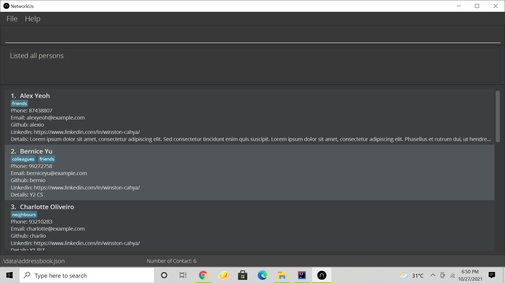
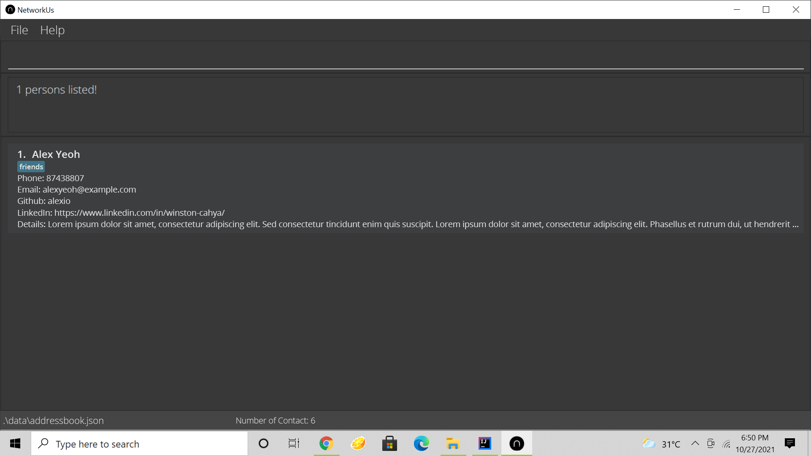
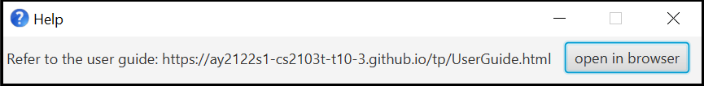

NetworkUS is a desktop app for organizing contacts. It features seamless **group management**, allowing for **quick searches of contacts with desired traits** (i.e specialization) and hence **project group formation**. It is catered for **Computer Science Students**. The app is optimized for the **Command Line Interface (CLI)** to allow swift access for keyboard users. The app is also complemented with **Graphical User Interface (GUI)** to display the program.

* Table of Contents
{:toc}

--------------------------------------------------------------------------------------------------------------------

## Before you read

This user guide is for users who want to use NetworkUS for their daily use or developer who wants to find out what this app does before contributing to project. This user guide will guide you on how to use NetworkUS to manage your contacts and groups.

## How to use the guide

1. Most of the Commands in NetworkUs acts on the currently viewable list. Thus, whenever there are mentions of Index used in Commands it means that it is the index in the currently displayed contacts list. 

Here `delete 3` will delete "Charlotte Oliviero" 

   Here `delete 3` will show an error message as 3 is not shown (Even though it is in the original list).
   

## Quick start

1. Ensure you have Java `11` or above installed in your Computer.

1. Download the latest `networkus.jar` from [here](https://github.com/AY2122S1-CS2103T-T10-3/tp).

1. Copy the file to the folder you want to use as the _home folder_ for your NetworkUS app.

1. Double-click the file to start the app. The GUI below should appear in a few seconds. Note how the app contains some sample data. 
   

1. Type the command in the command box and press Enter to execute it. e.g. typing **`help`** and pressing Enter will open the help window. 
   Some example commands you can try:

   * **`list`** : Lists all contacts.

   * **`add`**`n/John Doe p/98765432 e/johnd@example.com` : Adds a contact named `John Doe` to the NetworkUS.

   * **`delete`**`3` : Deletes the 3rd contact shown in the current list.

   * **`clear`** : Deletes all contacts.

   * **`exit`** : Exits the app.

1. Refer to the [Features](#features) below for details of each command.

--------------------------------------------------------------------------------------------------------------------

## User Interface

TODO: add labeled UI

## Features

**:information_source: Notes about the command format:** 

* Words in `UPPER_CASE` are the parameters to be supplied by the user. 
  e.g. in `add n/NAME`, `NAME` is a parameter which can be used as `add n/John Doe`.

* Items in square brackets are optional. 
  e.g `n/NAME [t/TAG]` can be used as `n/John Doe t/friend` or as `n/John Doe`.

* Items with `…`​ after them can be used multiple times including zero times. 
  e.g. `[t/TAG]…​` can be used as ` ` (i.e. 0 times), `t/friend`, `t/friend t/family` etc.

* Parameters with **prefixes** can be in any order. 
  e.g. if the command specifies `n/NAME p/PHONE_NUMBER`, `p/PHONE_NUMBER n/NAME` is also acceptable.

* If a parameter is expected only once in the command but you specified it multiple times, only the last occurrence of the parameter will be taken. 
  e.g. if you specify `p/12341234 p/56785678`, only `p/56785678` will be taken.

* Additional parameters for commands that do not take in parameters will be ignored. (such as `help`, `list`, `exit` and `clear`) 
  e.g. if the command specifies `help 123`, it will be interpreted as `help`.

### Viewing help : `help`

Provides functionality to access the help page in the browser.

Format: `help`  
Keyboard shortcut: `f1` then `enter`

### Adding a person: `add`

Adds a person to the list of contacts.

Format: `add n/NAME [p/PHONE_NUMBER] [e/EMAIL] [g/GITHUB_USERNAME] [l/LINKEDIN] [d/DETAIL] [t/TAG]…​`

:bulb: **Tip:**
A person can have any number of tags (including 0)

Examples:
* `add n/Johnny Sim p/91234567`
* `add n/Betsy Crowe t/friend e/betsycrowe@example.com p/1234567 t/criminal g/lovelyprisoner`

### Listing all persons : `list`

Shows a list of all persons in the contact list and the total number of contacts.

Format: `list`

### Editing a person : `edit`

Edits an existing person in the list of contact.

Format: `edit INDEX [n/NAME] [p/PHONE] [e/EMAIL] [g/GITHUB_USERNAME] [l/LINKEDIN] [d/DETAIL] [t/TAG]…​`

* Edits the person at the specified `INDEX`. The index refers to the index number shown in the displayed person list. The index **must be a positive integer** 1, 2, 3, …​
* At least one of the optional fields must be provided.
* Existing values will be updated to the input values.
* When editing tags, the existing tags of the person will be replaced.
* You can remove all the person’s tags by typing `t/` without specifying any tags after it. The same applies for description `d/`.

Examples:
*  `edit 1 p/91234567 e/johndoe@example.com` Edits the phone number and email address of the 1st person to be `91234567` and `johndoe@example.com` respectively.
*  `edit 2 n/Betsy Crower t/` Edits the name of the 2nd person to be `Betsy Crower` and clears all existing tags.

### Finding persons: `find`

Finds persons whose names or tags contain any of the given keywords from the list of contacts.

Format: `find KEYWORD [MORE_KEYWORDS]`

* The command is not case-sensitive, `find john` will match `John`
* Currently, only the name and their tags are searched.
* Persons whose names or tags match at least one keyword will be returned.
  `find john smith` will return `John Fletcher` and `Smith George`

Examples:
* `find John` will return `john`, `John Doe` and `Aaron john`
* `find jonas aaron silva` will return `jonas`, `Aaron john` and `Ann Silva`
* `find friends` will return anyone whose names or tags have the word `friends` in them

### Opening a field of a person : `open`

Opens the LinkedIn/Github page from details of field specified of a particular person from the NetworkUS contacts.

Format: `open INDEXES FIELD`

* The index contained in indexes refers to the index number shown in the displayed person list.
* The index **must be a positive integer** 1, 2, 3, …​
* The Field must be "github" or "linkedin"

Examples:
* `list` followed by `open 2 3 4 github` opens the github page of the 2nd, 3rd, and 4th person of the contact list.
* `find Betsy` followed by `open 1 linkedin` opens the github page of the 1st person in the results of the `find` command

### Deleting a person : `delete`

Deletes the specified person from the NetworkUS contacts.

Format: `delete INDEX`

* Deletes the person at the specified `INDEX`.
* The index refers to the index number shown in the displayed person list.
* The index **must be a positive integer** 1, 2, 3, …​

Examples:
* `list` followed by `delete 2` deletes the 2nd person in the contact list.
* `find Betsy` followed by `delete 1` deletes the 1st person in the results of the `find` command.
### Showing Person : `show`

Shows the specified person's full contact information in a separate window

Format: `show INDEX`

*Index must be the index that is in the currently visible list.

Examples:
*`show 1` will show the full details of the person with the specified index.

### Clearing all entries : `clear`

Clears all entries from the contact list.

Format: `clear`

### Exiting the program : `exit`

Exits the program.

Format: `exit`
## Tagging features

TODO: Elaborate on use cases of tagging features. Add tips for each command.

### Tagging displayed persons : `tagall`

Tags all displayed persons in the NetworkUS contacts with the specified tag.

Format: `tagall TAG`

* Tags all displayed persons with the specified `TAG`.
* Will not add duplicate tags and will run successfully even if all displayed persons already have the tag.
* The tag **must consist of letters and numbers without whitespaces** e.g. programmer, CS2103T

Examples:
* `list` followed by `tagall programmer` tags all persons in the contact list with the tag `programmer`.
* `find Alex` followed by `tagall CS2103T` tags all persons in the results of the `find` command with the tag `CS2103T`.

### Tagging persons : `tag`

Tags the specified persons from the NetworkUS contacts with the specified tag.

Format: `tag INDEXES TAG`

* Tags the persons at the specified `INDEXES`.
* The index refers to the index number shown in the displayed person list.
* The indexes **must be positive integers** 1, 2, 3, …​
* Tags must consist of letters and numbers without spaces.
* Will not add duplicate tags to persons.

Examples:
* `list` followed by `tag 1 2 programmer` tags the 1st and 2nd persons in the contact list with a programmer tag.
* `find John` followed by `tag 1 2 programmer` tags the 1st and 2nd persons in the results of the `find` command with a programmer tag.

### Untagging displayed persons: `untagall`

Deletes the specified tag from all displayed contacts in NetworkUS.

Format: `untagall TAG`

* Deletes specified `TAG` from all displayed contacts.
* Tags must consist of letters and numbers without spaces.

Example:
* `list` followed by `untagall CS2040` deletes CS2040 tag from all contact list.

### Untagging persons: `untag`

Delete the specified tag from the specified person from the NetworkUS contacts.

Format: `untag INDEXES TAG`

* Deletes the tag from the person at the specified `INDEXES`.
* The index refers to the index number shown in the displayed person list.
* The indexes **must be positive integers** 1, 2, 3, …​
* Tags must consist of letters and numbers without spaces.

Example:
* `list` followed by `untag 1 2 friend` deletes friend tag from 1st and 2nd persons in the contact list.
* `find John` followed by `untag 1 2 friend` deletes friend tag the 1st and 2nd persons in the results of the `find` command.

### Replace tag from all entries: `replacetag`

Replaces the specified tag from all displayed contacts in NetworkUS with a new tag.

Format: `replacetag TAG1 TAG2`

* Replaces `TAG1` with `TAG2` for all contacts.
* `TAG1` is the tag to be replaced.
* `TAG2` is the new tag to replace `TAG1`.
* Tags must consist of letters and numbers without spaces.

Example:
* `list` followed by `replacetag CS2040 CS2030` replaces CS2040 tag to CS2030 tag from all contact list.

### Showing tags : `showtags`

Shows all tags that are used in NetworkUS contacts.

Format: `showtags`

## Alias Features

### Aliasing commands : `alias`

Creates an alias for existing NetworkUS command.

Format: `alias EXISTING_COMMAND YOUR_ALIAS`

* Creates an alias `YOUR_ALIAS` for command `EXISTING_COMMAND`.
* `YOUR_ALIAS` can contain spaces, but cannot be empty.
* `EXISTING_COMMANDS` must be an existing command in NetworkUS (e.g. `list`, `tagall`, `untag`, etc.)
* `EXISTING_COMMANDS` and `YOUR_ALIAS` must be separated by a space.
* Aliases that you create will be saved.
* NetworkUS only replace your input with corresponding commands if the alias matches the prefix of your input.
* NetworkUS will check the **longest matching alias** in your input and change it with the corresponding command.

:exclamation: **Caution:**
Use it carefully. You may only create necessary aliases. Avoid using alias that is the prefix of any existing command. It may cause some command to be hindered by your alias.

### Showing Saved Aliases : `showalias`

Shows all aliases stored in the user preferences in a new window.

Format: `showalias`
Keyboard Shortcut: `F2`

Example:
* `showalias` will show the aliases in a new window.

### Dealiasing commands : `deletealias`

Deletes an existing alias.

Format: `deletealias YOUR_ALIAS`

* Deletes the specified alias.
* `YOUR_ALIAS` must be an existing alias in NetworkUS.

Example:
* `deletealias` followed by `tag -A` will remove the alias.

## Data Storage

### Saving the data

Contact list data are saved in the hard disk automatically after any command that changes the data. There is no need to save manually.

### Editing the data file

Contacts data are saved as a JSON file `[JAR file location]/data/networkus.json`. Advanced users are welcome to update data directly by editing that data file.

:exclamation: **Caution:**
If your changes to the data file makes its format invalid, NetworkUS will discard all data and start with an empty data file at the next run.

--------------------------------------------------------------------------------------------------------------------

## FAQ

**Q**: How do I transfer my data to another Computer? 
**A**: Install the app in the other computer and overwrite the empty data file it creates with the file that contains the data of your previous AddressBook home folder.

--------------------------------------------------------------------------------------------------------------------

## Misc

### Valid index

An index is valid if it is a **positive** integer. 
Example of valid indexes: `1`, `2`, `3`, ... 
Example of invalid indexes: `-1`, `0`, `*`, `+1`, ...

--------------------------------------------------------------------------------------------------------------------

## Glossary

### Displayed contacts

All contacts **displayed** in NetworkUS application.

:exclamation: **Caution:**
Most NetworkUS commands will execute on displayed contacts.

### Global contacts

All contacts that are **stored** in the NetworkUS.

--------------------------------------------------------------------------------------------------------------------

## Command summary

Action | Format, Examples
--------|------------------
**Add** | `add n/NAME [p/PHONE_NUMBER] [e/EMAIL] [g/GITHUB_USERNAME] [l/LINKEDIN] [d/DETAIL] [t/TAG]…​`   e.g., `add n/James Ho p/22224444 e/jamesho@example.com t/friend t/colleague`
**Alias** | `alias EXISTING_COMMAND YOUR_ALIAS`  e.g., `alias tagall tag -A`
**Clear** | `clear`
**Delete** | `delete INDEX`  e.g., `delete 3`
**Delete alias** | `deletealias YOUR_ALIAS`  e.g., `deletealias tag -A`
**Edit** | `edit INDEX [n/NAME] [p/PHONE_NUMBER] [e/EMAIL] [g/GITHUB_USERNAME] [l/LINKEDIN] [d/DETAIL] [t/TAG]…​`  e.g.,`edit 2 n/James Lee e/jameslee@example.com`
**Find** | `find KEYWORD [MORE_KEYWORDS]`  e.g., `find James Jake`
**Help** | `help`
**List** | `list`
**Replace tag** | `replacetag TAG1 TAG2`  e.g., `replacetag friend enemy`
**Show tags** | `showtags`
**Tag** | `tag INDEXES TAG`   e.g., `tag 1 2 programmer`
**Tag all** | `tagall TAG`   e.g., `tagall programmer`
**Untag** | `untag INDEXES TAG`  e.g., `untag 1 2 friend`
**Untag all** | `untagall TAG`  e.g., `untagall friend`

