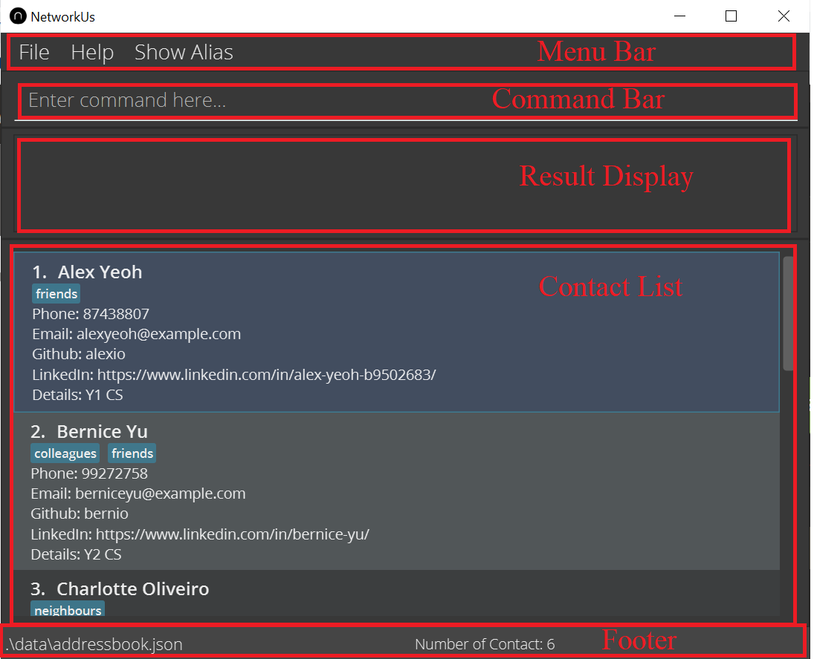

NetworkUS is a desktop app for organizing contacts. It features seamless **group management**, allowing for **quick searches of contacts with desired traits** (i.e specialization) and hence **project group formation**. It is catered for **Computer Science Students**. The app is optimized for the **Command Line Interface (CLI)** to allow swift access for keyboard users. The app is also complemented with **Graphical User Interface (GUI)** to display the program.

* Table of Contents
{:toc}

--------------------------------------------------------------------------------------------------------------------

## Before you read

This user guide is for users who want to use NetworkUS for their daily use or developer who wants to find out what this app does before contributing to project. This user guide will guide you on how to use NetworkUS to manage your contacts.

## How to use the guide

If this is the first time you are using NetworkUS, please refer to the [quick start](#quick-start) section to set up and start using NetworkUS.

If you are looking for a general overview of the commands refer to the [command summary](#command-summary) section. 

If you are unclear of what the command formats mean in the various explanations refer to the [features](#features) section.

If you are unsure of the meaning of any terms within this user guide, please refer to the [glossary](#glossary).

To jump to any particular section please refer to the table of contents found at the top of this guide.

## Quick start

1. Ensure you have Java `11` or above installed in your Computer.

1. Download the latest `networkus.jar` from [here](https://github.com/AY2122S1-CS2103T-T10-3/tp/releases/download/v1.3/networkus.jar).

1. Copy the file to the folder you want to use as the _home folder_ for your NetworkUS app.

1. Double-click the file to start the app. The GUI below should appear in a few seconds. Note how the app contains some sample data. 
   

1. Type the command in the command box and press `enter` to execute it. e.g. typing **`help`** and pressing `enter` will open the help window. 
   Some example commands you can try:

   * **`list`** : Lists all contacts.

   * **`add`**`n/John Doe p/98765432 e/johnd@example.com` : Adds a contact named `John Doe` to the NetworkUS.

   * **`delete`**`3` : Deletes the 3rd contact shown in the current list.

   * **`clear`** : Deletes all contacts.

   * **`exit`** : Exits the app.

1. Refer to the [Features](#features) below for details of each command.

--------------------------------------------------------------------------------------------------------------------

## User Interface

The image above shows the UI Components : 
1. Menu Bar : shows the 'Help' and 'Show Alias' option.
1. Command Bar : location for entering commands.
1. Result Display : shows result feedback from commands.
1. Contact List : shows the current contacts.
1. Footer : shows file path of the storage file and the total number of contacts.

## Features

**:information_source: Notes about the command format:** 

* Words in `UPPER_CASE` are the parameters to be supplied by the user. 
  e.g. in `add n/NAME`, `NAME` is a parameter which can be used as `add n/John Doe`.

* Items in square brackets are optional. 
  e.g `n/NAME [t/TAG]` can be used as `n/John Doe t/friend` or as `n/John Doe`.

* Items with `…`​ after them can be used multiple times including zero times. 
  e.g. `[t/TAG]…​` can be used as ` ` (i.e. 0 times), `t/friend`, `t/friend t/family` etc.

* Parameters with **prefixes** can be in any order. 
  e.g. if the command specifies `n/NAME p/PHONE_NUMBER`, `p/PHONE_NUMBER n/NAME` is also acceptable.

* If a parameter with **prefix** is expected only once in the command but you specified it multiple times, only the last occurrence of the parameter will be taken. 
  e.g. if you specify `p/12341234 p/56785678`, only `p/56785678` will be taken.

* Additional parameters for commands that do not take in parameters will be ignored. (such as `help`, `list`, `exit` and `clear`) 
  e.g. if the command specifies `help 123`, it will be interpreted as `help`.

* INDEXES allows multiple INDEX to be entered with each INDEX being separated with a space. 
  e.g. if you specify `tag 1 2 3 cs2030`, it will tag first, second and third persons in the displayed contact list.

### Viewing help : `help`

Provides functionality to access the help page in the browser.

Format: `help`  
Keyboard shortcut alternative: `f1` then press `enter`

### Adding a person: `add`

Adds a person to the list of contacts. You cannot add duplicate persons in the contact book.

Format: `add n/NAME [p/PHONE_NUMBER] [e/EMAIL] [g/GITHUB_USERNAME] [l/LINKEDIN] [d/DETAIL] [t/TAG]…​`

[What is considered a duplicate person.](#duplicate-detection)  
[List of what constitutes valid fields.](#valid-fields)

:bulb: **Tip:**
A person can have any number of tags (including 0)

Examples:
* `add n/Johnny Sim p/91234567`
* `add n/Betsy Crowe t/friend e/betsycrowe@example.com p/1234567 t/criminal g/lovelyprisoner`

### Listing all persons : `list`

Shows a list of all persons in the [global contacts](#global-contacts) and the total number of contacts.

Format: `list`

### Editing a person : `edit`

Edits an existing person in the list of contact.

Format: `edit INDEX [n/NAME] [p/PHONE] [e/EMAIL] [g/GITHUB_USERNAME] [l/LINKEDIN] [d/DETAIL] [t/TAG]…​`

* Edits the person at the specified `INDEX`. The index refers to the index number shown in the [displayed contacts](#displayed-contacts) list. The index **must be a positive integer** 1, 2, 3, …​
* At least one of the optional fields must be provided.
* Existing values will be updated to the input values.
* When editing tags, the existing tags of the person will be replaced.
* You can remove all the person’s tags by typing `t/` without specifying any tags after it. The same applies for description `d/`.
* Edited person should not result in duplicate persons in the contact book.

[What is considered a duplicate person.](#duplicate-detection)  
[List of what constitutes valid fields.](#valid-fields)

Examples:
*  `edit 1 p/91234567 e/johndoe@example.com` Edits the phone number and email address of the 1st person to be `91234567` and `johndoe@example.com` respectively.
*  `edit 2 n/Betsy Crower t/` Edits the name of the 2nd person to be `Betsy Crower` and clears all existing tags.
*  `edit 2 p/ g/` Removes the phone number and github user of the 2nd person.

:bulb: **Tip:**
You can remove specified fields by typing the field's prefix only. This applied for all fields except Name.

### Finding persons: `find`

Finds persons whose names or tags contain any of the given keywords from the list of contacts.

Format: `find KEYWORD [MORE_KEYWORDS]`

* The command is not case-sensitive, `find john` will match `John`
* Currently, only the name and their tags are searched.
* Persons whose names or tags match at least one keyword will be returned.
  `find john smith` will return `John Fletcher` and `Smith George`

Examples:
* `find John` will return `john`, `John Doe` and `Aaron john`
* `find jonas aaron silva` will return `jonas`, `Aaron john` and `Ann Silva`
* `find friends` will return anyone whose names or tags have the word `friends` in them

### Opening a field of a person : `open`

Opens the LinkedIn/Github page from details of field specified of a particular person from the NetworkUS contacts.

Format: `open INDEXES FIELD`

* The index contained in indexes refers to the index number shown in the [displayed contacts](#displayed-contacts) list.
* The index **must be a positive integer** 1, 2, 3, …​
* The Field must be `github` or `linkedin`

Examples:
* `list` followed by `open 2 3 4 github` opens the github page of the 2nd, 3rd, and 4th person of the [displayed contacts](#displayed-contacts) list.
* `find Betsy` followed by `open 1 linkedin` opens the LinkedIn page of the 1st person in the results of the `find` command

:exclamation: **Caution:**
This will redirect you to a web browser with the requested LinkedIn/Github page.

### Deleting a person : `delete`

Deletes the specified person from the NetworkUS contacts.

Format: `delete INDEX`

* Deletes the person at the specified `INDEX`.
* The index refers to the index number shown in the [displayed contacts](#displayed-contacts) list.
* The index **must be a positive integer** 1, 2, 3, …​

Examples:
* `list` followed by `delete 2` deletes the 2nd person in the [displayed contacts](#displayed-contacts) list.
* `find Betsy` followed by `delete 1` deletes the 1st person in the results of the `find` command.

### Showing person : `show`

Shows the specified person's full contact information in a separate window. Will show any truncated details or fields that are too long.

Format: `show INDEX`

* Index must be the index that is in the currently visible list.

Example:
* `show 1` will show the full details of the person with the specified index.

### Clearing all entries : `clear`

Clears all entries from the [global contacts](#global-contacts) list.

Format: `clear`

:exclamation: **Caution:**
This will clear all contacts data in NetworkUS !

### Exiting the program : `exit`

Exits the program.

Format: `exit`

--------------------------------------------------------------------------------------------------------------------

## Tagging features

You can use tag to categorize your contacts as you wish. You can tag them based on their modules taken, field of specialization or personality. This helps a lot when you want to find suitable project mate. For instance, you can tag certain contacts with OS to indicate that the person has specialization in operating systems. You can find all contacts that have specialization in OS by using the command `find OS`. The following are details of the tagging-related commands.

### Tagging displayed contacts : `tagall`

Tags all [displayed contacts](#displayed-contacts) in the NetworkUS contacts with the specified tag.

Format: `tagall TAG`

* Tags all [displayed contacts](#displayed-contacts) with the specified `TAG`.
* Will not add duplicate tags and will run successfully even if all [displayed contacts](#displayed-contacts) already have the tag.
* The tag **must consist of letters and/or numbers without spaces** e.g. programmer, CS2103T

Examples:
* `list` followed by `tagall programmer` tags all persons in the [global contacts](#global-contacts) list with the tag `programmer`.
* `find Alex` followed by `tagall CS2103T` tags all persons in the results of the `find` command with the tag `CS2103T`.

### Tagging persons : `tag`

Tags the specified persons from the NetworkUS contacts with the specified tag.

Format: `tag INDEXES TAG`

* Tags the persons at the specified `INDEXES`.
* The index refers to the index number shown in the [displayed contacts](#displayed-contacts) list.
* The indexes **must be positive integers** 1, 2, 3, …​
* Tag **must consist of letters and/or numbers without spaces**.
* Will not add duplicate tags to persons.

Examples:
* `list` followed by `tag 1 2 programmer` tags the 1st and 2nd persons in the [global contacts](#global-contacts) list with a programmer tag.
* `find John` followed by `tag 1 2 programmer` tags the 1st and 2nd persons in the results of the `find` command with a programmer tag.

### Untagging displayed contacts: `untagall`

Deletes the specified tag from all [displayed contacts](#displayed-contacts) in NetworkUS.

Format: `untagall TAG`

* Deletes specified `TAG` from all [displayed contacts](#displayed-contacts).
* Tag **must consist of letters and/or numbers without spaces**.

Example:
* `list` followed by `untagall CS2040` deletes CS2040 tag from all [global contacts](#global-contacts).

### Untagging persons: `untag`

Delete the specified tag from the specified person from the NetworkUS contacts.

Format: `untag INDEXES TAG`

* Deletes the tag from the person at the specified `INDEXES`.
* The index refers to the index number shown in the [displayed contacts](#displayed-contacts) list.
* The indexes **must be positive integers** 1, 2, 3, …​
* Tag **must consist of letters and/or numbers without spaces**.

Example:
* `list` followed by `untag 1 2 friend` deletes friend tag from 1st and 2nd persons in the [global contacts](#global-contacts) list.
* `find John` followed by `untag 1 2 friend` deletes friend tag from the 1st and 2nd persons in the results of the `find` command.

### Replace tag from all entries: `replacetag`

Replaces the specified tag from all [displayed contacts](#displayed-contacts) in NetworkUS with a new tag.

Format: `replacetag TAG1 TAG2`

* Replaces `TAG1` with `TAG2` for all contacts.
* `TAG1` is the tag to be replaced.
* `TAG2` is the new tag to replace `TAG1`.
* Tags **must consist of letters and/or numbers without spaces**.

Example:
* `list` followed by `replacetag CS2040 CS2030` replaces CS2040 tag to CS2030 tag from all [global contacts](#global-contacts).

### Showing tags : `showtags`

Shows all tags that are used in NetworkUS contacts.

Format: `showtags`

--------------------------------------------------------------------------------------------------------------------

## Alias Features

Alias helps you create more customized commands. You can shorten the existing commands, or even completely rename it with other names. Here are example use cases of alias:
* Create `tag -A` as an alias for `tagall` command
* Create `tag -D` as an alias for `untag` command

The following are details of the alias-related commands

### Aliasing commands : `alias`

Creates an alias for existing NetworkUS command.

Format: `alias EXISTING_COMMAND YOUR_ALIAS`

* Creates an alias `YOUR_ALIAS` for command `EXISTING_COMMAND`.
* `YOUR_ALIAS` can contain spaces, but cannot be empty.
* `EXISTING_COMMAND` must be an existing command in NetworkUS (e.g. `list`, `tagall`, `untag`, etc.)
* `EXISTING_COMMAND` and `YOUR_ALIAS` must be separated by a space.
* Aliases that you create will be saved.
* NetworkUS only replace your input with corresponding commands if the alias matches the **prefix word(s)** of your input.
  * A **word** is defined as contiguous characters whose character that comes after (if any) and before (if any) the word is a space.
  * For example: the alias `tag -A` will match the command `tag -A parameter`, but `tag -AD parameter` **will not be matched** even though `tag -A` matches the prefix of words `tag -AD`.
* NetworkUS will check the **longest matching alias** in your input and change it with the corresponding command.

Example:
* `alias tagall tag -A` will create an alias `tag -A` for the `tagall` command, allowing `tag -A` to represent `tagall`.
* `alias tagall tag` will throw an error as `tag` is an existing NetworkUS command. **You cannot create alias as an existing command name**.
* `alias notACommand tag -A` will throw an error as `notACommand` is not an existing NetworkUS command. **You are only able to create an alias for existing commands**.
* `alias tag add n/Your Name` will create alias `add n/Your Name` for the `tag` command. Note that this kind of alias is not recommended. See the **caution** section.

Example of how alias replacement works:
* Suppose that you have created two aliases (in any order):
  * `tag -A` as command `tagall`
  * `tag -A -D` as command `untagall`
* The command `tag -A -D OS` will be replaced as `untagall OS` regardless of the order of you create the aliases because the longest matching alias that matches the prefix word is `tag -A -D`.

:exclamation: **Caution:**
Use it carefully. You are encouraged to create appropriate aliases. Refrain from creating alias that resembles existing command syntax, such as create alias `add n/Your Name` as any `tag` or `add` or any other commands. **NetworkUS will not handle these cases for you.**

### Showing saved aliases : `showalias`

Shows all aliases stored in the user preferences in a new window.

Format: `showalias`
Keyboard Shortcut: `F2`

Example:
* `showalias` will show the aliases in a new window.

### Dealiasing commands : `deletealias`

Deletes an existing alias.

Format: `deletealias YOUR_ALIAS`

* Deletes the specified alias.
* `YOUR_ALIAS` must be an existing alias in NetworkUS.

Example:
* `deletealias tag -A` will remove the alias `tag -A`.

--------------------------------------------------------------------------------------------------------------------

## Data Storage

### Saving the data

Contact list data are saved in the hard disk automatically after any command that changes the data. There is no need to save manually.

### Editing the data file

Contacts data are saved as a JSON file `[JAR file location]/data/networkus.json`. Advanced users are welcome to update data directly by editing that data file.

:exclamation: **Caution:**
If your changes to the data file makes its format invalid, NetworkUS will discard all data and start with an empty data file at the next run.

--------------------------------------------------------------------------------------------------------------------

## FAQ

**Q**: How do I transfer my data to another Computer? 
**A**: Install the app in the other computer and overwrite the empty data file it creates with the file that contains the data of your previous ContactBook home folder.

--------------------------------------------------------------------------------------------------------------------

## Miscellaneous

### Duplicate detection

**Checked fields**: `Phone`, `Email`, `Github` and `Linkedin`

A person is considered a duplicate in any of the below cases:
* All of that person's **Checked fields** are empty, and there is another contact with the same name and also having all their **Checked fields** empty.
* That person has the same name as another contact, and also at least one identical non-empty **Checked field**. 

:exclamation: **Note:**
The equality check for the names of 2 contacts disregards capitalization and spaces in the names being compared. 

### Valid Fields

Below are the requirements for what constitutes as valid for the fields in NetworkUS.

Field | Format, Examples
--------|------------------
**Name** | Only letters and/or numbers and spaces   e.g., `Sam Yeo`
**Tag** | Letters and/or numbers without spaces   e.g., `CS2103T` , `programmer`
**Phone** |  Only numbers at least 3 digits long   e.g., `999` , `62353535`
**Email** | `local-part` + @ + `domain-name`   `local-part` contains letters, numbers and special characters excluding `+` `-` `_` `.`, cannot start or end with special characters   `domain-name` consists of `domain labels` seperated by periods   `domain labels` consist of at least 2 letters and/or numbers   `domain labels` excluding the last `domain label` can have non-consecutive hyphens but cannot start or end with a hyphen   e.g., `berniceyu@example.com`
**Github** | Only letters, numbers and hyphens   Cannot start or end with a hyphen or have multiple consecutive hyphens   Has a maximum length of 39 characters   e.g., `Alexio`
**LinkedIn** | Any valid LinkedIn URL   e.g., `https://www.linkedin.com/in/benson/`
**Details** | Anything you can type in   e.g., `Quite literally anything you can type in.`

### Valid index

An index is valid if it is a **positive** integer. 
Example of valid indexes: `1`, `2`, `3`, ... 
Example of invalid indexes: `-1`, `0`, `*`, `+1`, ...

--------------------------------------------------------------------------------------------------------------------

## Glossary

### Displayed contacts

All contacts **displayed** in NetworkUS application.

Most of the commands in NetworkUS act on the currently viewable list. Thus, whenever there are mentions of Index used in Commands it refers to the index of the currently displayed contacts list. 

Here `delete 3` will delete "Charlotte Oliviero" 

Here `delete 3` will show an error message as 3 is not shown (Even though it is in the original list).

:exclamation: **Caution:**
Most NetworkUS commands will execute on displayed contacts.

### Global contacts

All contacts that are **stored** in the NetworkUS.

### Field

A field is specific information of a person in NetworkUS's contact list like phone number.

### JavaScript Object Notation (JSON)

JSON is the file format that NetworkUS used to store the contacts.

### Graphical User Interface (GUI)

A GUI is an interface that uses visual indicator to interact with the system.

### Command Line Interface (CLI)

A CLI is a text-based interface that uses text input to interact with the system.

### Command

A command is an instruction that you can use in NetworkUS to perform certain task.

### Prefix

Prefixes are unique identifiers in front of paramenters that is used by NetworkUS to identify which fields the value belong to.

### Alias

Aliases are alternative words that you can use to represent the standard commands that NetworkUS used.

--------------------------------------------------------------------------------------------------------------------

## Command summary

Action | Format, Examples
--------|------------------
[**Add**](#adding-a-person-add) | `add n/NAME [p/PHONE_NUMBER] [e/EMAIL] [g/GITHUB_USERNAME] [l/LINKEDIN] [d/DETAIL] [t/TAG]…​`   e.g., `add n/James Ho p/22224444 e/jamesho@example.com t/friend t/colleague`
[**Alias**](#aliasing-commands--alias) | `alias EXISTING_COMMAND YOUR_ALIAS`  e.g., `alias tagall tag -A`
[**Clear**](#clearing-all-entries--clear) | `clear`
[**Delete**](#deleting-a-person--delete) | `delete INDEX`  e.g., `delete 3`
[**Delete alias**](#dealiasing-commands--deletealias) | `deletealias YOUR_ALIAS`  e.g., `deletealias tag -A`
[**Edit**](#editing-a-person--edit) | `edit INDEX [n/NAME] [p/PHONE_NUMBER] [e/EMAIL] [g/GITHUB_USERNAME] [l/LINKEDIN] [d/DETAIL] [t/TAG]…​`  e.g.,`edit 2 n/James Lee e/jameslee@example.com`
[**Find**](#finding-persons-find) | `find KEYWORD [MORE_KEYWORDS]`  e.g., `find James Jake`
[**Help**](#viewing-help--help) | `help`
[**List**](#listing-all-persons--list) | `list`
[**Replace tag**](#replace-tag-from-all-entries-replacetag) | `replacetag TAG1 TAG2`  e.g., `replacetag friend enemy`
[**Show alias**](#showing-saved-aliases--showalias) | `showalias`
[**Show tags**](#showing-tags--showtags) | `showtags`
[**Tag**](#tagging-persons--tag) | `tag INDEXES TAG`   e.g., `tag 1 2 programmer`
[**Tag all**](#tagging-displayed-persons--tagall) | `tagall TAG`   e.g., `tagall programmer`
[**Untag**](#untagging-persons-untag) | `untag INDEXES TAG`  e.g., `untag 1 2 friend`
[**Untag all**](#untagging-displayed-persons-untagall) | `untagall TAG`  e.g., `untagall friend`

