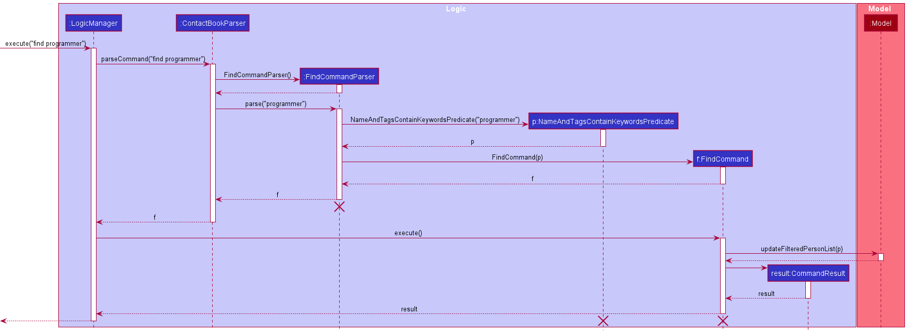
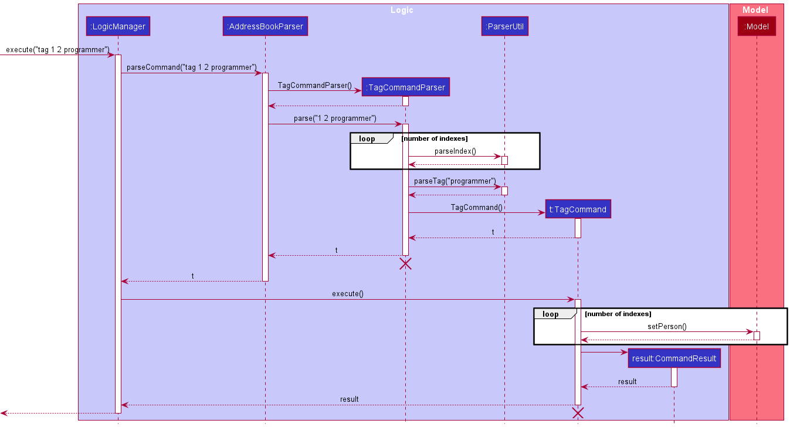
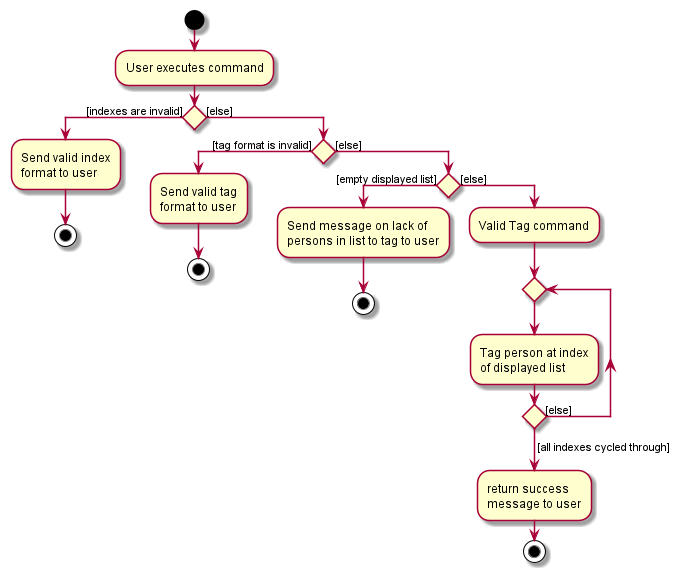

### Project: NetworkUS

NetworkUS is a desktop app for organizing contacts. It features seamless **group management**, allowing for **quick searches of contacts with desired traits** (i.e specialization) and hence **project group formation**. It is catered for **Computer Science Students** with fields such as Github and Linkedin. The app is optimized for the **Command Line Interface (CLI)** to allow swift access for keyboard users. The app is also complemented with **Graphical User Interface (GUI)** to display the program.

Given below are my contributions to the project.

* **New Feature**: Added the ability to find persons based on their tags.
    * What it does: allows the user to search for persons based on what they are classified by.
    * Justification: This feature is a main feature of the app, allowing the user to find persons based on their classification and moreover, persons who are capable in what the user requires.
    * Highlights: This enhancement affects commands to be added in the future. It required an in-depth analysis of design alternatives. The implementation was challenging as it required changes to existing commands.

* **New Feature**: Added the ability to tag persons more effectively.
    * What it does: allows the user to tag multiple persons directly simultaneously.
    * Justification: This feature improves the product significantly because a user can classify a group of persons easily.
    * Highlights: This enhancement affects existing commands and commands to be added in the future. It required an in-depth analysis of design alternatives.

* **New Feature**: Modified the duplicate detection amongst persons in NetworkUS.
    * What it does: prevents the user from creating multiple duplicate persons.
    * Justification: This feature improves the product significantly because a user can make mistakes in adding extra references to the same persons. The app should prevent that from happening.
    * Highlights: This enhancement affects existing commands. It required an in-depth analysis of design alternatives. The implementation was difficult as it required changes to existing commands.

* **Code contributed**: [RepoSense link](https://nus-cs2103-ay2122s1.github.io/tp-dashboard/?search=e0543403&sort=groupTitle&sortWithin=title&since=2021-09-17&timeframe=commit&mergegroup=&groupSelect=groupByRepos&breakdown=false)

* **Project management**:
    * Managed releases `v1.2` - `v1.4` (4 releases) on GitHub
    
* **Documentation**:
  * User Guide:
    * Added documentation for the features `find`, `tag`, `tagall`, `duplicate detection` and `valid fields` [\#48](https://github.com/AY2122S1-CS2103T-T10-3/tp/pull/48) [\#75](https://github.com/AY2122S1-CS2103T-T10-3/tp/pull/75) [\#82](https://github.com/AY2122S1-CS2103T-T10-3/tp/pull/82) [\#159](https://github.com/AY2122S1-CS2103T-T10-3/tp/pull/159)
    
  * Developer Guide:
    * Add user stories
    * Added implementation details of the `find` and `tag` feature.
    * Added Sequence diagrams for `find` and `tag` feature.
    * Added Activity diagram for `tag` feature.
  
Sequence diagram for find feature

Sequence diagram for tag feature

Activity diagram for tag feature

* **Community**:
    * PRs reviewed (with non-trivial review comments): [\#93](https://github.com/AY2122S1-CS2103T-T10-3/tp/pull/93), [\#102](https://github.com/AY2122S1-CS2103T-T10-3/tp/pull/102)
    
