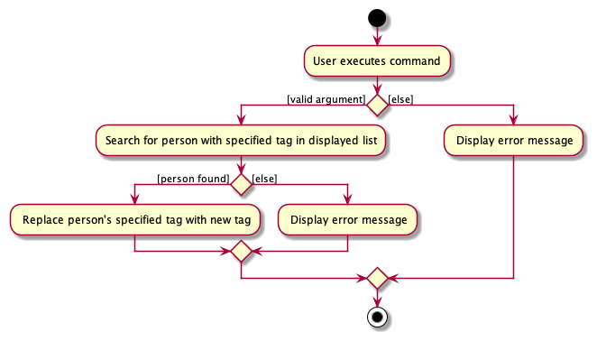

### Project: NetworkUS

NetworkUS is a desktop app for organizing contacts. It features seamless **group management**, by allowing for **quick searches of contacts with desired traits** (i.e specialization) and hence **project group formation**. It is catered for **Computer Science Students** with fields such as Github and Linkedin.
The app is optimized for the **Command Line Interface (CLI)** to allow swift access for keyboard users. The app is also complemented with **Graphical User Interface (GUI)** to display the program.

Given below are my contributions to the project.

* **New Feature**: Added the ability to remove a tag from persons more effectively.
    * What it does: allows the user to remove a specified tag from multiple persons simultaneously.
    * Justification: This feature improves the product significantly because it allows users to remove tags easily.
      The tagging system is one of the important features of NetworkUS which allows user to categorise their contacts. Removing tag for multiple contacts simultaneously allows users to use the tagging system easier and faster.
    * Highlights: This enhancement affects existing commands and commands to be added in the future. It required an in-depth analysis of design alternatives.

* **New Feature**: Added the ability to replace a tag from persons more effectively.
    * What it does: allows the user to replace specified tag from multiple persons with a new tag simultaneously.
    * Justification: The tagging system is one of the important features of NetworkUS which allows user to categorise their contacts. 
      Being able to replace a tag for multiple contacts allows user to use the tagging system easier and faster. This encourages users to keep their tags up-to-date.
    * Highlights: This enhancement affects existing commands and commands to be added in the future. It required an in-depth analysis of design alternatives.

* **New Feature**: Modified Person to allow empty field.
   * What it does: provides user with the options to not add fields they do not want.
   * Justification: This feature improves the product significantly because it provides flexibility to the user to add only necessary information.
   * Highlights: This enhancement affects existing commands. The implementation required changes to the existing commands like `add` and `edit`. It required an in-depth analysis of design alternatives.

* **Code contributed**: [RepoSense link](https://nus-cs2103-ay2122s1.github.io/tp-dashboard/?search=T10-3&sort=groupTitle&sortWithin=title&timeframe=commit&mergegroup=&groupSelect=groupByRepos&breakdown=true&checkedFileTypes=docs~functional-code~test-code~other&since=2021-09-17&tabOpen=true&tabType=authorship&tabAuthor=jeromewjj&tabRepo=AY2122S1-CS2103T-T10-3%2Ftp%5Bmaster%5D&authorshipIsMergeGroup=false&authorshipFileTypes=docs~functional-code~test-code~other&authorshipIsBinaryFileTypeChecked=false)

* **Project management**:
    * Handled the Github issue tracker and added/kept track of issues to be resolved.

* **Enhancements to existing features**: 
    * Modified `add` and `edit` commands to allow NetworkUS to accept empty field.
    * Remove `address` field from NetworkUS.

* **Documentation**:
    * User Guide:
        * Added documentation for the features `untag`, `untagall` and `replacetag` [\#80](https://github.com/AY2122S1-CS2103T-T10-3/tp/pull/80)
  
    * Developer Guide:
        * Added documentation for implementation of `replacetag` and empty field features. [\#168](https://github.com/AY2122S1-CS2103T-T10-3/tp/pull/168)
        * Added Sequence diagrams for `replacetag` feature. [\#168](https://github.com/AY2122S1-CS2103T-T10-3/tp/pull/168)
        * Added Activity diagram for `replacetag` feature. [\#168](https://github.com/AY2122S1-CS2103T-T10-3/tp/pull/168)

Sequence diagram for replace tag feature  

Activity diagram for replace tag feature  

* **Community**:
    * PRs reviewed: [\#89](https://github.com/AY2122S1-CS2103T-T10-3/tp/pull/89), [\#93](https://github.com/AY2122S1-CS2103T-T10-3/tp/pull/93), [\#97](https://github.com/AY2122S1-CS2103T-T10-3/tp/pull/97)
  
